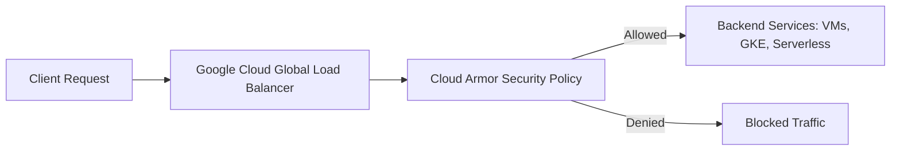

# Understanding Google Cloud Armor: A Complete Guide

Securing applications exposed to the internet has become more critical than ever. Distributed Denial-of-Service (DDoS) attacks, malicious traffic, and abuse patterns are increasing in frequency and complexity. Google Cloud offers **Cloud Armor**, a powerful security service designed to protect your workloads at scale.  

In this blog, we'll explore Cloud Armor from the ground up—what it is, how it works, features, use cases, pricing, and best practices.  

---

## 🌐 What is Google Cloud Armor?

**Google Cloud Armor** is a **web application firewall (WAF) and DDoS protection service** integrated into Google Cloud Platform (GCP). It provides **defense against L3/L4 network-based attacks** and **application-level (L7) threats**, ensuring your workloads remain available and secure.

Cloud Armor sits in front of your Google Cloud load balancers and filters traffic **before it reaches your backend services**.  

---

## 🛡️ Key Features of Cloud Armor

1. **DDoS Protection**  
   - Built on Google's global infrastructure.  
   - Mitigates volumetric and protocol-based attacks.  
   - Always-on protection with no need for manual intervention.

2. **Web Application Firewall (WAF)**  
   - Pre-configured WAF rules based on **OWASP Top 10** vulnerabilities.  
   - Custom security policies using **rules language**.  
   - Block SQL injection, XSS, remote file inclusion, etc.

3. **Adaptive Protection (ML-powered)**  
   - Machine Learning analyzes traffic patterns.  
   - Detects **L7 DDoS attacks** and anomalies in real-time.  
   - Generates **suggested rules** to block abusive requests.

4. **Rate Limiting**  
   - Prevents abuse by limiting requests per IP or region.  
   - Useful for login endpoints, APIs, and high-traffic apps.

5. **Geo-based Access Control**  
   - Allow/Deny traffic from specific countries.  
   - Commonly used for compliance and fraud prevention.

6. **Integration with Cloud Logging & Monitoring**  
   - Logs every request decision.  
   - Seamlessly integrates with **Cloud Monitoring, BigQuery, and SIEMs**.  

---

## 🏗️ How Cloud Armor Works




---

## ⚙️ Setting Up Cloud Armor

1. **Create a Security Policy**

```
gcloud compute security-policies create my-security-policy \
    --description "Cloud Armor WAF policy"
```

2. **Add Rules (Example: Block SQL Injection)**

```
gcloud compute security-policies rules create 1000 \
    --security-policy my-security-policy \
    --expression "evaluatePreconfiguredWaf('sqli-v33-stable')" \
    --action deny-403
```

3. **Attach Policy to a Backend Service**

```
gcloud compute backend-services update my-backend-service \
    --security-policy my-security-policy
```

---

## 📊 Example Use Cases
1. **DDoS Protection for Websites**
	•	E-commerce site under a volumetric attack.
	•	Cloud Armor automatically scales defense.
2.	**API Protection**
	•	Rate-limiting prevents credential stuffing or brute force.
	•	WAF policies filter malicious JSON payloads.
3.	**Geo-restriction**
	•	Financial applications allow access only from specific regions.
4.	**Adaptive Protection**
	•	Detects suspicious traffic patterns (e.g., repeated login failures).
	•	Suggests rules to mitigate without human intervention.


---

## 💰 Pricing Overview

Cloud Armor pricing is based on:
	•	Policy Charges: $5 per security policy per month.
	•	Rule Charges: $1 per rule per month (after first 5 free).
	•	Request Charges: $0.75 per million requests evaluated.
	•	Adaptive Protection: Additional charges apply.

[**🔗 Official Pricing**](https://cloud.google.com/armor/pricing)

---

## ✅ Best Practices
	•	Start in Preview Mode: Test rules in preview before enforcing.
	•	Layered Security: Combine Cloud Armor with IAM, VPC SC, Identity-Aware Proxy.
	•	Enable Logging: Export logs to BigQuery for analysis.
	•	Use Adaptive Protection: Let ML handle evolving attack vectors.
	•	Monitor Regularly: Create dashboards in Cloud Monitoring.
 ---

## 🚀 Why Choose Cloud Armor?

Google Cloud Armor brings Google-scale security to your workloads. Instead of building custom firewalls or relying on external appliances, you benefit from Google's battle-tested defense mechanisms used to protect services like YouTube, Gmail, and Search.
	•	Scalability: Protection grows with your traffic.
	•	Simplicity: Integrates natively with Google Cloud load balancers.
	•	Cost-efficient: Pay per request, not per appliance.

---

## 🔮 Conclusion

Cloud Armor is not just a firewall—it's a comprehensive security shield for your cloud workloads. By combining DDoS protection, WAF, adaptive ML-based detection, and granular access controls, it allows businesses to focus on growth while staying secure.

If you're running internet-facing workloads on GCP, Cloud Armor should be a key part of your security strategy.