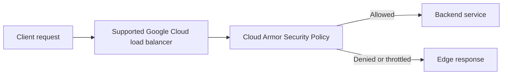

Cloud Armor applies edge security policies to supported Google Cloud load-balancing backends. It is useful when a team needs to reject hostile requests, apply web application firewall rules, or throttle abusive clients before traffic reaches the application.

It is not a replacement for application authorization, IAM, private networking, or secure code. Treat it as one control in a layered design and verify the exact load balancer and backend type you plan to protect.

## Where Cloud Armor fits

Google's infrastructure provides network-level DDoS protection for supported services. A Cloud Armor security policy adds request evaluation at the edge. Depending on the policy type and attached endpoint, rules can match IP ranges, geography, request attributes, threat-intelligence lists, or preconfigured WAF signatures.

The main controls are:

- **Custom rules:** allow, deny, redirect, or throttle matching traffic.
- **Preconfigured WAF rules:** detect common application attacks such as SQL injection and cross-site scripting. Tune signatures for the application instead of enabling every rule blindly.
- **Rate limiting:** throttle or temporarily ban clients that exceed a configured threshold. The chosen key and thresholds determine whether legitimate users sharing an address are affected.
- **Adaptive Protection:** analyze Layer 7 traffic and produce alerts or suggested mitigations. Available capabilities depend on the Cloud Armor tier.
- **Logging:** record policy decisions in Cloud Logging when request logging is enabled on the load balancer.

## Request path


```mermaid
flowchart LR
    A[Client request] --> B[Supported Google Cloud load balancer]
    B --> C[Cloud Armor Security Policy]
    C -->|Allowed| D[Backend service]
    C -->|Denied or throttled| E[Edge response]
```

The policy is associated with a supported backend service or backend bucket. Requests are evaluated by priority; the lowest numeric priority is evaluated first. Every policy also has a default rule, so review that behavior before attaching the policy.

## Create and test a policy

Create a global backend security policy:

```bash
gcloud compute security-policies create my-security-policy \
    --description "Cloud Armor WAF policy"
```

Add a preconfigured SQL injection rule in preview mode. Preview records what the rule would do without enforcing the deny action:

```bash
gcloud compute security-policies rules create 1000 \
    --security-policy my-security-policy \
    --expression "evaluatePreconfiguredWaf('sqli-v33-stable')" \
    --action deny-403 \
    --preview
```

Attach the policy to the intended global backend service:

```bash
gcloud compute backend-services update my-backend-service \
    --security-policy my-security-policy \
    --global
```

Generate representative traffic, then inspect preview matches in Cloud Logging. Check false positives by path, client type, and expected payload. When the result is acceptable, update the rule to remove preview mode. Keep a rollback command and an owner for every enforced rule.

## Pricing model

Cloud Armor Standard is pay as you go. Current charges vary by policy scope and can include security-policy hours, rule hours, and evaluated requests. Cloud Armor Enterprise Paygo and Annual use different protected-resource, subscription, and data-processing models. There is no general "first five rules are free" assumption to use in an estimate.

Pricing and tier features change, so calculate from the active [Cloud Armor pricing page](https://cloud.google.com/armor/pricing) and the actual number of policies, rules, requests, protected resources, and outbound data for the design.

## Production checklist

- Confirm that the frontend and backend type supports the intended policy.
- Keep the default rule explicit and review rule priority for shadowing.
- Start new WAF and custom expressions in preview mode.
- Enable request logging and alert on deny, throttle, and preview-match changes.
- Tune preconfigured WAF signatures against real application requests.
- Avoid using source IP as identity when proxies or shared networks make it ambiguous.
- Protect administrative paths with application authentication even when an edge rule restricts access.
- Review pricing and Enterprise enrollment at the project and billing-account level.
- Store policy creation and rule changes in reviewed automation where possible.

## References

- [Cloud Armor overview](https://cloud.google.com/armor/docs/cloud-armor-overview)
- [Security policy concepts](https://cloud.google.com/armor/docs/security-policy-concepts)
- [Cloud Armor pricing](https://cloud.google.com/armor/pricing)
