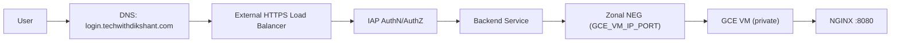

# Secure an NGINX Login Website on GCP with IAP (gcloud CLI Only)

If your goal is to expose a simple login website but block direct public access, Google Cloud Identity-Aware Proxy (IAP) is a reliable pattern.

In this guide, we secure `login.techwithdikshant.com` with:

1. A private GCE VM running NGINX
2. Zonal NEG backend
3. HTTPS Load Balancer
4. Cloud Armor policy
5. IAP access restricted to `techwithdikshant.com`

All steps are shown with `gcloud` commands only.

---

## Architecture



---

## Prerequisites

1. Project: `dikshant`
2. VPC/Subnet: `dikshant-dev-network` / `dikshant-dev-subnet`
3. DNS control for `techwithdikshant.com`
4. APIs enabled: Compute, IAP, DNS
5. Permission to update IAM/IAP policy

Set project:

```bash
gcloud config set project dikshant
```

Enable APIs:

```bash
gcloud services enable \
  compute.googleapis.com \
  iap.googleapis.com \
  dns.googleapis.com
```

---

## Step 1: Create a Private VM with NGINX Login Page

This VM has no external IP and serves a static login page through NGINX on port `8080`.

```bash
gcloud compute instances create login-dev \
  --zone=us-central1-a \
  --machine-type=e2-medium \
  --network=dikshant-dev-network \
  --subnet=dikshant-dev-subnet \
  --no-address \
  --tags=internal-only,login-dev-backend \
  --service-account=YOUR_COMPUTE_SA_EMAIL \
  --scopes=https://www.googleapis.com/auth/cloud-platform \
  --image-family=ubuntu-2204-lts \
  --image-project=ubuntu-os-cloud \
  --boot-disk-size=20GB \
  --boot-disk-type=pd-balanced \
  --metadata=startup-script='#!/bin/bash
set -euxo pipefail
apt-get update
apt-get install -y nginx

cat > /var/www/html/index.html <<EOF
<!doctype html>
<html>
  <head>
    <meta charset="utf-8" />
    <meta name="viewport" content="width=device-width, initial-scale=1" />
    <title>Login</title>
    <style>
      body { font-family: Arial, sans-serif; margin: 0; background: #f5f7fb; }
      .wrap { max-width: 420px; margin: 64px auto; background: #fff; border: 1px solid #e5e7eb; border-radius: 10px; padding: 24px; }
      h1 { margin: 0 0 16px; font-size: 24px; }
      input { width: 100%; padding: 10px; margin: 8px 0 14px; border: 1px solid #d1d5db; border-radius: 8px; }
      button { width: 100%; padding: 10px; border: 0; border-radius: 8px; background: #111827; color: #fff; }
      .muted { color: #6b7280; font-size: 12px; margin-top: 12px; }
    </style>
  </head>
  <body>
    <div class="wrap">
      <h1>Login</h1>
      <form>
        <label>Email</label>
        <input type="email" placeholder="you@techwithdikshant.com" />
        <label>Password</label>
        <input type="password" placeholder="********" />
        <button type="button">Sign in</button>
      </form>
      <p class="muted">This page is protected by Google IAP.</p>
    </div>
  </body>
</html>
EOF

cat > /etc/nginx/sites-available/login-site <<EOF
server {
  listen 8080 default_server;
  server_name _;

  location = /healthz {
    add_header Content-Type text/plain;
    return 200 "ok";
  }

  location / {
    root /var/www/html;
    index index.html;
    try_files \$uri \$uri/ /index.html;
  }
}
EOF

rm -f /etc/nginx/sites-enabled/default
ln -sf /etc/nginx/sites-available/login-site /etc/nginx/sites-enabled/login-site
nginx -t
systemctl enable --now nginx
'
```

---

## Step 2: Configure Firewall for LB to VM Traffic

Allow only Google LB/health check IP ranges to backend port `8080`:

```bash
gcloud compute firewall-rules create allow-login-dev-lb-healthcheck \
  --project=dikshant \
  --network=dikshant-dev-network \
  --direction=INGRESS \
  --priority=900 \
  --action=ALLOW \
  --rules=tcp:8080 \
  --source-ranges=35.191.0.0/16,130.211.0.0/22 \
  --target-tags=login-dev-backend
```

Explicit public deny on `8080` for safety:

```bash
gcloud compute firewall-rules create deny-login-dev-public-8080 \
  --project=dikshant \
  --network=dikshant-dev-network \
  --direction=INGRESS \
  --priority=950 \
  --action=DENY \
  --rules=tcp:8080 \
  --source-ranges=0.0.0.0/0 \
  --target-tags=login-dev-backend
```

---

## Step 3: Create Health Check + Zonal NEG + Endpoint

```bash
gcloud compute health-checks create http login-dev-hc \
  --global \
  --port=8080 \
  --request-path=/healthz \
  --check-interval=10s \
  --timeout=5s \
  --healthy-threshold=2 \
  --unhealthy-threshold=3
```

```bash
gcloud compute network-endpoint-groups create login-dev-neg \
  --zone=us-central1-a \
  --network-endpoint-type=gce-vm-ip-port \
  --network=dikshant-dev-network \
  --subnet=dikshant-dev-subnet \
  --default-port=8080
```

```bash
gcloud compute network-endpoint-groups update login-dev-neg \
  --zone=us-central1-a \
  --add-endpoint="instance=login-dev,ip=$(gcloud compute instances describe login-dev --zone=us-central1-a --format='value(networkInterfaces[0].networkIP)'),port=8080"
```

---

## Step 4: Create Backend Service and Attach NEG

```bash
gcloud compute backend-services create login-dev \
  --global \
  --load-balancing-scheme=EXTERNAL_MANAGED \
  --protocol=HTTP \
  --port-name=http \
  --timeout=30s \
  --health-checks=login-dev-hc
```

```bash
gcloud compute backend-services add-backend login-dev \
  --global \
  --network-endpoint-group=login-dev-neg \
  --network-endpoint-group-zone=us-central1-a \
  --balancing-mode=RATE \
  --max-rate=1000 \
  --capacity-scaler=1.0
```

---

## Step 5: Create and Attach Cloud Armor Policy

Create policy:

```bash
gcloud compute security-policies create login-dev-cloud-armor-policy \
  --description="Policy for login.techwithdikshant.com"
```

Deny non-target host header traffic:

```bash
gcloud compute security-policies rules create 650 \
  --security-policy=login-dev-cloud-armor-policy \
  --action=deny-403 \
  --expression="request.headers['host'] != 'login.techwithdikshant.com' && request.headers['host'] != 'login.techwithdikshant.com:443'" \
  --description="Deny non-login host headers"
```

Allow IAP callback:

```bash
gcloud compute security-policies rules create 700 \
  --security-policy=login-dev-cloud-armor-policy \
  --action=allow \
  --expression="request.headers['host'] == 'login.techwithdikshant.com' && request.query.contains('gcp-iap-mode=AUTHENTICATING')" \
  --description="Allow IAP callback flow"
```

Throttle login traffic:

```bash
gcloud compute security-policies rules create 900 \
  --security-policy=login-dev-cloud-armor-policy \
  --action=throttle \
  --expression="request.headers['host'] == 'login.techwithdikshant.com' && request.path.startsWith('/login')" \
  --rate-limit-threshold-count=30 \
  --rate-limit-threshold-interval-sec=60 \
  --conform-action=allow \
  --exceed-action=deny-429 \
  --enforce-on-key=IP \
  --description="Throttle login endpoint"
```

Deny non-website paths:

```bash
gcloud compute security-policies rules create 950 \
  --security-policy=login-dev-cloud-armor-policy \
  --action=deny-403 \
  --expression="request.headers['host'].matches('^login\\.techwithdikshant\\.com$|^login\\.techwithdikshant\\.com:443$') && !request.path.matches('^/$|^/login$|^/logout$|^/favicon\\.ico$|^/public/.*$')" \
  --description="Deny non-login website paths"
```

Baseline rate limit:

```bash
gcloud compute security-policies rules create 1000 \
  --security-policy=login-dev-cloud-armor-policy \
  --action=throttle \
  --expression="request.headers['host'] == 'login.techwithdikshant.com'" \
  --rate-limit-threshold-count=300 \
  --rate-limit-threshold-interval-sec=60 \
  --conform-action=allow \
  --exceed-action=deny-429 \
  --enforce-on-key=IP \
  --description="Baseline rate limit"
```

Attach policy:

```bash
gcloud compute backend-services update login-dev \
  --global \
  --security-policy=login-dev-cloud-armor-policy
```

---

## Step 6: Create Dedicated HTTPS Load Balancer

Reserve global IP:

```bash
gcloud compute addresses create login-dev-alb-ip \
  --global \
  --ip-version=IPV4
```

Create managed cert:

```bash
gcloud compute ssl-certificates create login-dev-alb-certificate \
  --global \
  --domains=login.techwithdikshant.com
```

Create URL map:

```bash
gcloud compute url-maps create login-dev-alb \
  --global \
  --default-service=login-dev
```

Create HTTPS proxy:

```bash
gcloud compute target-https-proxies create login-dev-alb-target-proxy \
  --global \
  --url-map=login-dev-alb \
  --ssl-certificates=login-dev-alb-certificate
```

Create forwarding rule:

```bash
gcloud compute forwarding-rules create login-dev-alb-fe \
  --global \
  --load-balancing-scheme=EXTERNAL_MANAGED \
  --target-https-proxy=login-dev-alb-target-proxy \
  --address=login-dev-alb-ip \
  --ports=443
```

---

## Step 7: Enable IAP and Restrict Access to Domain

Enable IAP:

```bash
gcloud compute backend-services update login-dev \
  --global \
  --iap=enabled
```

Grant domain access:

```bash
gcloud iap web add-iam-policy-binding \
  --resource-type=backend-services \
  --service=login-dev \
  --member='domain:techwithdikshant.com' \
  --role='roles/iap.httpsResourceAccessor'
```

---

## Step 8: DNS and Validation

Get frontend IP:

```bash
gcloud compute forwarding-rules describe login-dev-alb-fe \
  --global \
  --project=dikshant \
  --format='value(IPAddress)'
```

Create DNS A record:

1. `login.techwithdikshant.com -> <ALB_IP>`

Check health:

```bash
gcloud compute backend-services get-health login-dev --global
```

Check IAP policy:

```bash
gcloud iap web get-iam-policy \
  --resource-type=backend-services \
  --service=login-dev
```

Open:

1. `https://login.techwithdikshant.com`

Expected:

1. IAP challenge appears first
2. Only `techwithdikshant.com` users can continue
3. NGINX login page renders after successful IAP authorization

---

## Common Pitfalls

1. DNS points to wrong forwarding rule IP
2. Certificate is not `ACTIVE` yet
3. Health check path does not return `200`
4. Forgetting to bind `roles/iap.httpsResourceAccessor`
5. Overly broad Cloud Armor expressions that block valid requests

---

## Final Takeaway

This pattern gives a clean internet-facing entry point with strong identity control:

1. Private VM backend
2. HTTPS LB
3. Cloud Armor filtering
4. IAP domain restriction

Users can reach the website only after IAP authorization, without opening broad VPN-style network access.
