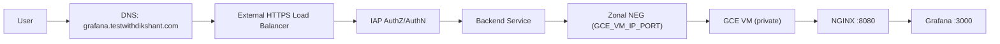

# Secure a Grafana Domain on GCP with IAP (gcloud CLI Only)

If your goal is to expose Grafana on a custom domain while keeping access restricted to your organization, Google Cloud Identity-Aware Proxy (IAP) is a strong pattern.

In this guide, we secure `grafana.testwithdikshant.com` with:

1. A private GCE VM running Grafana + NGINX
2. Zonal NEG backend
3. HTTPS Load Balancer
4. Cloud Armor policy
5. IAP access restricted to `testwithdikshant.com`

All steps are shown with `gcloud` commands only.

---

## Architecture



---

## Prerequisites

1. Project: `dikshant`
2. VPC/Subnet: `dikshant-dev-network` / `dikshant-dev-subnet`
3. Existing ALB for `app-dev.testwithdikshant.com` (`dikshant-alb`)
4. DNS control for `testwithdikshant.com`
5. OAuth client ID/secret for IAP/Grafana Google auth

Set project:

```bash
gcloud config set project dikshant
```

Enable APIs:

```bash
gcloud services enable \
  compute.googleapis.com \
  iap.googleapis.com \
  dns.googleapis.com
```

---

## Step 1: Create a Private VM for Grafana

This VM has no external IP and is tagged for restricted ingress.

```bash
gcloud compute instances create grafana-dev \
  --zone=us-central1-a \
  --machine-type=e2-standard-2 \
  --network=dikshant-dev-network \
  --subnet=dikshant-dev-subnet \
  --no-address \
  --tags=internal-only,grafana-dev-backend \
  --service-account=YOUR_COMPUTE_SA_EMAIL \
  --scopes=https://www.googleapis.com/auth/cloud-platform \
  --image-family=ubuntu-2204-lts \
  --image-project=ubuntu-os-cloud \
  --boot-disk-size=50GB \
  --boot-disk-type=pd-balanced \
  --metadata=startup-script='#!/bin/bash
set -euxo pipefail
apt-get update
apt-get install -y docker.io docker-compose-plugin
systemctl enable --now docker
usermod -aG docker ubuntu || true
'
```

---

## Step 2: Add Firewall Rules for the VM Backend Port

Allow only Google LB/health-check ranges to NGINX port `8080`:

```bash
gcloud compute firewall-rules create allow-grafana-dev-lb-healthcheck \
  --project=dikshant \
  --network=dikshant-dev-network \
  --direction=INGRESS \
  --priority=900 \
  --action=ALLOW \
  --rules=tcp:8080 \
  --source-ranges=35.191.0.0/16,130.211.0.0/22 \
  --target-tags=grafana-dev-backend
```

Optional but recommended explicit deny for public `8080`:

```bash
gcloud compute firewall-rules create deny-grafana-dev-public-8080 \
  --project=dikshant \
  --network=dikshant-dev-network \
  --direction=INGRESS \
  --priority=950 \
  --action=DENY \
  --rules=tcp:8080 \
  --source-ranges=0.0.0.0/0 \
  --target-tags=grafana-dev-backend
```

---

## Step 3: Run Grafana + NGINX with Docker Compose

SSH into VM using your standard private/IAP method and deploy your stack.

Quick health verification from VM:

```bash
curl -i http://127.0.0.1:8080/healthz
curl -I http://127.0.0.1:8080/login
```

Note:

1. Keep Grafana on internal port `3000`
2. Keep NGINX listening on `8080`
3. Configure `root_url` as `https://grafana.testwithdikshant.com`
4. Use secrets injection for OAuth secret, do not hardcode in image

---

## Step 4: Create Health Check + Zonal NEG + Endpoint

Create backend health check:

```bash
gcloud compute health-checks create http grafana-dev-hc \
  --global \
  --port=8080 \
  --request-path=/healthz \
  --check-interval=10s \
  --timeout=5s \
  --healthy-threshold=2 \
  --unhealthy-threshold=3
```

Create zonal NEG of type `GCE_VM_IP_PORT`:

```bash
gcloud compute network-endpoint-groups create grafana-dev-neg \
  --zone=us-central1-a \
  --network-endpoint-type=gce-vm-ip-port \
  --network=dikshant-dev-network \
  --subnet=dikshant-dev-subnet \
  --default-port=8080
```

Attach VM endpoint:

```bash
gcloud compute network-endpoint-groups update grafana-dev-neg \
  --zone=us-central1-a \
  --add-endpoint="instance=grafana-dev,ip=$(gcloud compute instances describe grafana-dev --zone=us-central1-a --format='value(networkInterfaces[0].networkIP)'),port=8080"
```

---

## Step 5: Create Backend Service and Attach NEG

Create backend service:

```bash
gcloud compute backend-services create grafana-dev \
  --global \
  --load-balancing-scheme=EXTERNAL_MANAGED \
  --protocol=HTTP \
  --port-name=http \
  --timeout=30s \
  --health-checks=grafana-dev-hc
```

Attach NEG to backend service:

```bash
gcloud compute backend-services add-backend grafana-dev \
  --global \
  --network-endpoint-group=grafana-dev-neg \
  --network-endpoint-group-zone=us-central1-a \
  --balancing-mode=RATE \
  --max-rate=1000 \
  --capacity-scaler=1.0
```

---

## Step 6: Create and Attach a Dedicated Cloud Armor Policy

Create policy:

```bash
gcloud compute security-policies create grafana-dev-cloud-armor-policy \
  --description="Dedicated policy for grafana.testwithdikshant.com"
```

Block common SQLi:

```bash
gcloud compute security-policies rules create 800 \
  --security-policy=grafana-dev-cloud-armor-policy \
  --action=deny-403 \
  --expression="request.headers['host']=='grafana.testwithdikshant.com' && evaluatePreconfiguredWaf('sqli-stable')" \
  --description="Block SQLi"
```

Block common XSS:

```bash
gcloud compute security-policies rules create 810 \
  --security-policy=grafana-dev-cloud-armor-policy \
  --action=deny-403 \
  --expression="request.headers['host']=='grafana.testwithdikshant.com' && evaluatePreconfiguredWaf('xss-stable')" \
  --description="Block XSS"
```

Rate limit login endpoints:

```bash
gcloud compute security-policies rules create 900 \
  --security-policy=grafana-dev-cloud-armor-policy \
  --action=throttle \
  --expression="request.headers['host']=='grafana.testwithdikshant.com' && (request.path.startsWith('/login') || request.path.startsWith('/api/login'))" \
  --rate-limit-threshold-count=30 \
  --rate-limit-threshold-interval-sec=60 \
  --conform-action=allow \
  --exceed-action=deny-429 \
  --enforce-on-key=IP \
  --description="Throttle login endpoints"
```

Baseline rate limit:

```bash
gcloud compute security-policies rules create 1000 \
  --security-policy=grafana-dev-cloud-armor-policy \
  --action=throttle \
  --expression="request.headers['host']=='grafana.testwithdikshant.com'" \
  --rate-limit-threshold-count=300 \
  --rate-limit-threshold-interval-sec=60 \
  --conform-action=allow \
  --exceed-action=deny-429 \
  --enforce-on-key=IP \
  --description="Baseline rate limit"
```

Attach policy to backend:

```bash
gcloud compute backend-services update grafana-dev \
  --global \
  --security-policy=grafana-dev-cloud-armor-policy
```

---

## Step 7: Reuse Existing ALB for `grafana.testwithdikshant.com`

Create managed certificate for Grafana host:

```bash
gcloud compute ssl-certificates create dikshant-alb-certificate-grafana \
  --global \
  --domains=grafana.testwithdikshant.com
```

Update existing HTTPS target proxy to include both certs:

```bash
gcloud compute target-https-proxies update dikshant-alb-target-proxy \
  --global \
  --ssl-certificates=dikshant-alb-certificate,dikshant-alb-certificate-grafana
```

Add host rule/path matcher to existing URL map:

```bash
gcloud compute url-maps add-path-matcher dikshant-alb \
  --global \
  --path-matcher-name=path-matcher-grafana-dev \
  --default-service=grafana-dev \
  --new-hosts=grafana.testwithdikshant.com
```

---

## Step 8: Enable IAP and Restrict Access to `testwithdikshant.com`

Enable IAP on backend service:

```bash
gcloud compute backend-services update grafana-dev \
  --global \
  --iap=enabled,oauth2-client-id=YOUR_OAUTH_CLIENT_ID,oauth2-client-secret=YOUR_OAUTH_CLIENT_SECRET
```

Fetch backend numeric ID:

```bash
gcloud compute backend-services describe grafana-dev \
  --global \
  --format='value(id)'
```

Grant IAP access to your Workspace domain:

```bash
gcloud iap web add-iam-policy-binding \
  --resource-type=backend-services \
  --service="$(gcloud compute backend-services describe grafana-dev --global --format='value(id)')" \
  --member='domain:testwithdikshant.com' \
  --role='roles/iap.httpsResourceAccessor'
```

---

## Step 9: DNS and Validation

Get ALB frontend IP:

```bash
gcloud compute forwarding-rules describe dikshant-alb-fe \
  --global \
  --project=dikshant \
  --format='value(IPAddress)'
```

Point DNS A record:

1. `grafana.testwithdikshant.com -> <ALB_IP>`

Check backend health:

```bash
gcloud compute backend-services get-health grafana-dev --global
```

Check IAP policy:

```bash
gcloud iap web get-iam-policy \
  --resource-type=backend-services \
  --service="$(gcloud compute backend-services describe grafana-dev --global --format='value(id)')"
```

Open in browser:

1. `https://grafana.testwithdikshant.com`

Expected behavior:

1. IAP prompts for Google authentication/authorization first
2. Only users from `testwithdikshant.com` are allowed
3. Grafana OAuth then handles app-level session

---

## Common Pitfalls

1. Hardcoding OAuth secrets in `grafana.ini` or Docker image
2. Leaving VM backend publicly reachable
3. Wrong `root_url` in Grafana (must match external domain)
4. Missing host rule/path matcher in URL map
5. Certificate not yet `ACTIVE` at time of test

---

## Final Takeaway

For internal observability endpoints, this pattern is robust:

1. Private VM backend
2. External HTTPS LB
3. Cloud Armor
4. IAP domain-restricted access
5. Grafana Google OAuth for app-level auth

It gives a clean identity boundary without VPN-style broad network exposure.

