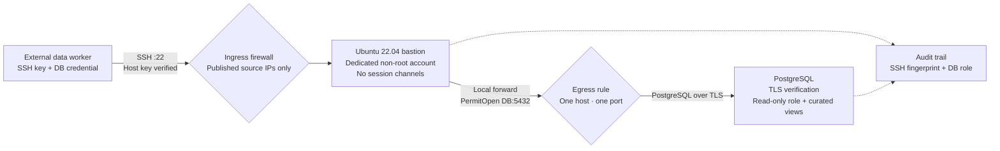

# The SSH Tunnel Worked. That Wasn't the Same as Making It Safe.

_How we gave an external data service read-only PostgreSQL access through an Ubuntu bastion—and boxed the connection in tightly enough that a stolen key would not become a general-purpose foothold._

The first error looked ordinary:

```text
ssh: handshake failed: ssh: unable to authenticate,
attempted methods [none publickey], no supported methods remain
```

We already had a bastion. SSH was running. The firewall allowed the provider's published addresses, and the public key shown in its dashboard was sitting on the server. On paper, the setup was almost finished.

It wasn't.

The first temptation was to keep changing SSH settings until the connection turned green. That is a risky way to debug a bastion. A permissive configuration can make the error disappear while quietly giving a third-party service far more access than it needs.

So we stepped back and defined the one thing this account should be able to do:

> Arrive from a known provider address, authenticate with one key, and open a local SSH forward to one PostgreSQL host on port 5432.

No terminal. No commands. No SFTP. No reverse tunnels. No access to other hosts in the private network.

This post covers the resulting setup on Ubuntu 22.04, including the small file-permission mistake that caused our public-key failure and the PostgreSQL TLS error that appeared immediately after we fixed it.

## What we were building

The examples use documentation-only addresses:

```text
External worker:       203.0.113.10/32 and 203.0.113.11/32
Bastion:               203.0.113.20:22
SSH account:           tunneluser
PostgreSQL endpoint:   10.20.0.15:5432
Database:              reporting
Database role:         tunneluser
```

Replace them with your own values. In particular, use the exact source addresses published for your account region. Do not copy an allowlist from a screenshot, an old ticket, or an unrelated product from the same vendor.

The finished path looks like this:



There are two credentials and two encrypted connections here. The SSH key gets the worker through the bastion. The PostgreSQL credential authorizes database access. SSH protects the route to the database; PostgreSQL TLS protects and authenticates the database connection itself. Treating those as interchangeable is how weak tunnel designs happen.

## Start with the firewall, not `sshd_config`

Our bastion was already on the internet, which meant its logs were full of the usual background noise: attempts for users such as `centos`, `ftpuser`, and `user1`, plus connections that reset before authentication. None of those entries explained the provider's failure.

The firewall is the first useful filter. Port 22 should accept connections from two kinds of sources only:

1. the provider's documented egress addresses; and
2. a separate administrative route, such as Google Cloud IAP.

Keep those in separate firewall rules. A rule named `customer-data-tunnel` should not slowly collect home-office addresses, old contractors, IAP ranges, and unrelated SaaS products. Separate rules make ownership and later cleanup much less ambiguous.

Do not leave a broader `0.0.0.0/0` allow rule at a different priority. Public-key authentication is valuable, but it is not a reason to expose SSH to everyone.

Ingress is only half of the boundary. The bastion should also be allowed to reach the intended database endpoint on port 5432—not every private address and port in the VPC. That egress restriction matters if the SSH key or the daemon is ever compromised.

Before touching SSH, I checked basic reachability from the bastion:

```bash
if timeout 5 bash -c 'exec 3<>/dev/tcp/10.20.0.15/5432'; then
  echo "PostgreSQL endpoint is reachable"
else
  echo "PostgreSQL endpoint is not reachable"
fi
```

This is intentionally a boring test. It proves that routing and firewalling allow a TCP connection. It says nothing about database credentials or TLS, but it prevents an SSH investigation from being derailed by a network problem farther down the path.

## We did not reuse the administrator account

The old setup used an existing bastion account. That was convenient, but it tied an automated integration to a human identity with history and privileges we did not want to inherit.

Using `root` would have been worse. Root SSH login is normally disabled on Ubuntu for good reason, and enabling it for a tunnel would turn a leaked third-party key into a server takeover. A tunnel does not need root. It barely needs a Unix account at all.

We created one account whose name described its purpose:

```bash
sudo useradd \
  --create-home \
  --user-group \
  --shell /usr/sbin/nologin \
  --comment "Restricted PostgreSQL SSH tunnel" \
  tunneluser

sudo passwd --lock tunneluser
getent passwd tunneluser
id tunneluser
```

The account had no supplementary groups. In particular, it was not a member of `sudo`, `docker`, or `lxd`; each can create a path to root.

The `nologin` shell is useful, but it is not the main control. Port forwarding does not require an interactive shell, and SSH has several channel types. We would later disable session channels in sshd as well.

## The public key file—and the mistake that cost us time

For service accounts, I prefer an authorization file under `/etc/ssh` rather than `~/.ssh/authorized_keys`. The account can use the key, but it cannot replace the file with a different one.

We created it like this:

```bash
sudo install \
  --owner=root \
  --group=tunneluser \
  --mode=0640 \
  /dev/null \
  /etc/ssh/tunneluser_authorized_keys

sudoedit /etc/ssh/tunneluser_authorized_keys
```

The public key must remain on one physical line. We also bound the key to its source addresses and destination:

```text
from="203.0.113.10/32,203.0.113.11/32",restrict,port-forwarding,permitopen="10.20.0.15:5432" ssh-rsa AAAAB3... external-tunnel
```

The slightly odd-looking combination of `restrict` and `port-forwarding` is deliberate. `restrict` turns off forwarding along with PTY, agent, X11, and user-RC capabilities. `port-forwarding` then enables forwarding again, while `permitopen` limits it to the database.

Our first version of this file was `root:root` with mode `0600`. It felt secure: only root could read or modify it. It was also the reason authentication failed.

The key fingerprint in the SSH log matched the key in the file, yet sshd still rejected it. The target account could not read the configured authorization file during the relevant check. The fix was not `chmod 644`, and it certainly was not making the service account the owner. We used group-readable, root-writable permissions:

```bash
sudo chown root:tunneluser /etc/ssh/tunneluser_authorized_keys
sudo chmod 0640 /etc/ssh/tunneluser_authorized_keys
```

That leaves modification under root's control while allowing the account to read the key material it is supposed to use.

These checks would have exposed the mistake immediately:

```bash
sudo namei -l /etc/ssh/tunneluser_authorized_keys
sudo ls -l /etc/ssh/tunneluser_authorized_keys
sudo -u tunneluser test -r /etc/ssh/tunneluser_authorized_keys \
  && echo readable \
  || echo not-readable
sudo ssh-keygen -lf /etc/ssh/tunneluser_authorized_keys
```

One RSA detail is worth calling out. A public key beginning with `ssh-rsa` is an RSA key; it does not necessarily mean the connection uses the obsolete RSA/SHA-1 signature. In our logs, the client used a modern RSA/SHA-2 signature. We did not weaken `PubkeyAcceptedAlgorithms` to enable legacy `ssh-rsa`.

## Restrict the account in sshd as well

Key options are useful, but they are easy to lose during a future rotation. We repeated the important restrictions in a user-specific sshd policy.

```bash
sudoedit /etc/ssh/sshd_config.d/99-tunneluser.conf
```

The drop-in contained:

```sshconfig
Match User tunneluser
    AuthenticationMethods publickey
    PubkeyAuthentication yes
    PasswordAuthentication no
    KbdInteractiveAuthentication no
    AuthorizedKeysFile /etc/ssh/tunneluser_authorized_keys

    AllowTcpForwarding local
    PermitOpen 10.20.0.15:5432
    PermitListen none
    MaxSessions 0

    X11Forwarding no
    AllowAgentForwarding no
    PermitTTY no
    PermitUserRC no
    GatewayPorts no
```

`AllowTcpForwarding local` permits the direction we need and rejects reverse forwarding. `PermitOpen` fixes the destination. `MaxSessions 0` is the important, less obvious line: it prevents shell, command, and subsystem sessions while still allowing forwarding channels.

I did not use `ForceCommand internal-sftp`. That would grant file-transfer access, which the integration did not need. Nor did I add a custom shell script to keep a connection alive. The native sshd controls already express the policy more clearly.

## Validate without locking yourself out

Changing SSH remotely deserves a little ceremony. I kept the working administrator session open and opened a second one before reloading anything.

First, syntax:

```bash
sudo sshd -t
```

No output is the successful result.

Then I inspected the policy sshd would actually apply, including the username and provider source address:

```bash
sudo sshd -T \
  -C user=tunneluser,host=bastion.example.com,addr=203.0.113.10 \
  | grep -E 'authenticationmethods|authorizedkeysfile|allowtcpforwarding|permitopen|permitlisten|maxsessions|passwordauthentication|kbdinteractiveauthentication|permittty|allowagentforwarding|x11forwarding|permituserrc|gatewayports'
```

This is more reliable than reading one configuration file. OpenSSH configuration is order-sensitive, and another `Match` block or included file can change the effective result.

Finally, we reloaded rather than restarted the daemon:

```bash
sudo systemctl reload ssh
sudo systemctl is-active ssh
```

On Ubuntu the service is normally called `ssh`, even though the process and configuration binary use `sshd`.

## The error changed—and that was good news

Once SSH authentication worked, the provider returned a completely different error:

```text
pg_hba.conf rejects connection for host "10.0.0.83",
user "tunneluser", database "postgres", no encryption
```

That message looked like another failure, but it told us something valuable: the tunnel was open and PostgreSQL was now receiving the connection. Continuing to edit SSH at that point would have been a mistake.

The phrase `no encryption` meant the PostgreSQL client was not using database TLS while the server policy required it. We enabled SSL in the database connection and used a `hostssl` rule appropriate for the address PostgreSQL saw.

With a local SSH forward, PostgreSQL usually sees the bastion's private address—not the public address of the external worker. A representative rule looks like this:

```text
hostssl reporting tunneluser 10.0.0.83/32 scram-sha-256
```

Where possible, use `sslmode=verify-full` with a trusted CA and a database hostname matching the certificate. `require` encrypts the connection but does not provide the same protection against an impostor database endpoint.

We also pinned the bastion's host key on the external side. The public key on the server authenticates the worker to the bastion; the bastion host key authenticates the bastion to the worker. Without the latter, a client that blindly accepts host-key changes can be redirected to an attacker-controlled SSH server.

Host-key fingerprints can be collected on the bastion with:

```bash
for key in /etc/ssh/ssh_host_*_key.pub; do
  sudo ssh-keygen -lf "$key"
done
```

## The database account was intentionally boring

The PostgreSQL role did not need to write, create schemas, replicate, bypass row-level security, or inspect the entire application database.

```sql
CREATE ROLE tunneluser
    LOGIN
    NOSUPERUSER
    NOCREATEDB
    NOCREATEROLE
    NOINHERIT
    NOREPLICATION
    NOBYPASSRLS
    CONNECTION LIMIT 3;

GRANT CONNECT ON DATABASE reporting TO tunneluser;
GRANT USAGE ON SCHEMA integration_export TO tunneluser;
GRANT SELECT ON ALL TABLES IN SCHEMA integration_export TO tunneluser;
```

Rather than granting broad access to production tables, we exposed a small `integration_export` schema containing views with only the rows and columns required by the sync. This is one of the most effective controls in the design. If the external service is compromised, the attacker gets exactly what the database role can read—not everything the bastion can reach.

If future tables or views should inherit access, configure default privileges as the role that will own those objects:

```sql
ALTER DEFAULT PRIVILEGES IN SCHEMA integration_export
GRANT SELECT ON TABLES TO tunneluser;
```

That command is ownership-sensitive. Running it as an unrelated administrator does not automatically change defaults for objects created by the application owner.

## A green connection was only the first test

We first proved the intended path from an approved test address:

```bash
ssh \
  -N \
  -L 15432:10.20.0.15:5432 \
  -i ./test-tunnel-key \
  -o IdentitiesOnly=yes \
  -o StrictHostKeyChecking=yes \
  tunneluser@203.0.113.20
```

Then we tested the controls. Each of the following was expected to fail:

```bash
# Interactive shell
ssh -i ./test-tunnel-key -o IdentitiesOnly=yes tunneluser@203.0.113.20

# Remote command
ssh -i ./test-tunnel-key -o IdentitiesOnly=yes tunneluser@203.0.113.20 id

# SFTP subsystem
sftp -i ./test-tunnel-key tunneluser@203.0.113.20

# A different private destination
ssh -N -L 18080:10.20.0.99:8080 \
  -i ./test-tunnel-key -o IdentitiesOnly=yes \
  tunneluser@203.0.113.20

# Reverse forwarding
ssh -N -R 18080:127.0.0.1:8080 \
  -i ./test-tunnel-key -o IdentitiesOnly=yes \
  tunneluser@203.0.113.20
```

We also attempted the connection from an address outside the provider allowlist. Ideally the firewall drops that traffic before sshd can process it. The key's `from=` restriction remains a second check in case the network rule changes later.

At the database layer, reads through the approved views succeeded. Inserts, updates, schema access outside `integration_export`, and object creation failed.

## How we debugged the public-key failure

The most useful step was filtering the logs by the expected username and source address instead of staring at every event on the bastion:

```bash
sudo journalctl -u ssh -f -o cat \
  | grep --line-buffered -E 'tunneluser|203\.0\.113\.10|publickey|signature algorithm|account|authentication'
```

The relevant line included a fingerprint:

```text
Failed publickey for tunneluser from 203.0.113.10 ... RSA SHA256:abc123...
```

We compared it with the installed key:

```bash
sudo ssh-keygen -lf /etc/ssh/tunneluser_authorized_keys
```

That comparison divides the investigation neatly:

- If the fingerprints differ, the external client is offering the wrong private key.
- If they match, the key reached the server. Check file readability, key restrictions, account state, and effective sshd policy.

For the second case, these commands cover most failures:

```bash
sudo passwd --status tunneluser
sudo namei -l /etc/ssh/tunneluser_authorized_keys
sudo -u tunneluser test -r /etc/ssh/tunneluser_authorized_keys
sudo sshd -T \
  -C user=tunneluser,host=bastion.example.com,addr=203.0.113.10 \
  | grep -E 'pubkeyauthentication|authorizedkeysfile|authenticationmethods|allowtcpforwarding|permitopen|maxsessions'
```

When normal logging is not enough, `LogLevel DEBUG3` can be added temporarily inside the user's `Match` block. Validate, reload, reproduce one attempt, and remove it afterward; debug-level SSH logging is noisy.

```bash
sudo sshd -t
sudo systemctl reload ssh
sudo journalctl -u ssh --since "2 minutes ago" --no-pager -o cat \
  | grep -E 'tunneluser|debug|publickey|authorized|Authentication'
```

The sequence of errors matters. A public-key rejection is an SSH problem. A `pg_hba.conf` message means SSH forwarding reached PostgreSQL. A database permission error means both the tunnel and database login worked, but the query exceeded the role's grants. Debug the layer that actually produced the message.

## Rotation and the day-two work

The setup is not finished when the first sync succeeds. Someone must be able to answer: Which key is this? Who owns it? When does it rotate? How do we shut it off quickly?

We monitor SSH activity by username, source address, and key fingerprint. At PostgreSQL, we monitor logins and query behavior by database role. The names can be the same for convenience, but they are separate identities and should remain independently revocable.

For a normal SSH-key rotation, add the new restricted public key as a second line, confirm a connection with it, and only then remove the old line. Rotate the database credential separately through the normal secret-management process.

For an incident, the shortest containment path may be any combination of:

- removing the authorized key;
- blocking the provider addresses temporarily;
- disabling the PostgreSQL login or rotating its password;
- terminating active database sessions; and
- preserving SSH, firewall, and PostgreSQL logs.

Removing the SSH key does not claw back data already synchronized, and it does not neutralize a database password copied somewhere else. The residual risk of any data integration is the data already delivered to it. That is why the database view should expose the smallest useful dataset in the first place.

When the integration is retired, remove the job, database login and sessions, public key, sshd drop-in, firewall rules, Unix account, database grants, and export views. A forgotten allow rule or dormant service account has a habit of surviving long after everyone remembers why it exists.

## The practical checklist

Before calling the connection production-ready, I want every answer below to be yes:

- Is the SSH identity dedicated, non-root, passwordless, and outside privileged groups?
- Can the key arrive only from documented provider addresses?
- Can sshd forward only to the exact PostgreSQL host and port?
- Do shell, command, SFTP, reverse-forwarding, and alternate-destination tests fail?
- Is bastion egress restricted as well as ingress?
- Does the client verify the bastion host key?
- Does PostgreSQL require TLS and use a separate read-only role?
- Is the exported dataset limited through a dedicated schema or views?
- Can we identify the key by fingerprint and revoke both credentials independently?
- Have we documented what to remove when the integration is decommissioned?

## What I would do differently next time

I would start with the fingerprint and readability checks instead of rereading the public key by eye. A 700-character RSA key can look correct while being the wrong key, and a perfectly correct key is useless when the configured file cannot be read.

I would also treat each new error as evidence of progress. When the message changed from an SSH handshake failure to PostgreSQL's `no encryption` rejection, the right move was to stop touching SSH. The request had crossed the bastion and reached the next security boundary.

Most importantly, I would define the tunnel as a capability rather than an account. The provider did not need to “log in to the bastion.” It needed permission to carry one encrypted database connection through it. Once we described the requirement that way, the firewall rules, key options, sshd policy, database grants, and tests all became much easier to reason about.
