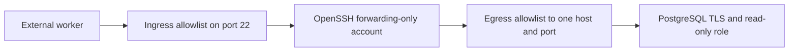

An SSH tunnel that connects successfully can still be dangerously broad. A third-party worker may need one local port forward to PostgreSQL, while the same key can accidentally inherit shell access, SFTP, reverse forwarding, or reachability to every private service visible from the bastion.

This guide defines the tunnel as one capability: an approved source can authenticate with one key and forward TCP traffic to one PostgreSQL host on port `5432`. The examples assume Ubuntu 22.04 or 24.04, OpenSSH, and PostgreSQL 16 or newer. They were reviewed against current OpenSSH and PostgreSQL documentation on August 31, 2026; verify package-specific behavior in a staging bastion before changing production SSH.

## Scope and security model

The example uses documentation-only addresses:

```text
External worker addresses: 203.0.113.10/32, 203.0.113.11/32
Bastion address:            203.0.113.20:22
Bastion private address:    10.20.0.10
Unix account:               pg_tunnel
PostgreSQL endpoint:        10.20.0.15:5432
PostgreSQL hostname:        database.internal.example
Database and role:          reporting / report_reader
```

Replace every value with an approved source of truth. Provider egress ranges change, so record who owns the allowlist and when it was last verified.



The design has separate controls at each boundary:

- the firewall restricts which source can reach SSH;
- the SSH key and daemon restrict the available channel and destination;
- the bastion egress policy restricts its network reach;
- PostgreSQL TLS authenticates and encrypts the database connection; and
- the database role limits which data the integration can read.

SSH encrypts traffic only through the bastion. The bastion-to-database leg still needs PostgreSQL TLS. A database password does not replace the SSH key, and the SSH key does not authorize database queries.

## Prerequisites

Before editing OpenSSH, prepare:

- an existing hardened bastion with a working out-of-band or separate administrative path;
- the external service's exact egress CIDRs and SSH public key fingerprint;
- a database hostname whose certificate chains to a trusted certificate authority;
- a curated database schema or views for the required dataset; and
- an incident owner who can revoke the SSH key and database credential independently.

Keep an existing administrator session open while validating changes. A malformed SSH policy can lock out every remote administrator.

## Implement the restricted tunnel

### Restrict network ingress and egress first

Allow TCP port `22` only from the documented worker CIDRs. Put administrative access in a separate rule with a separate owner. Audit for a broader rule at another priority; a specific allowlist does not help if `0.0.0.0/0` is also allowed.

Restrict bastion egress to `10.20.0.15:5432` for this integration. `PermitOpen` controls OpenSSH, while egress filtering limits the process at the network layer if a key restriction or daemon policy changes later.

Confirm only TCP reachability before debugging authentication:

```bash
timeout 5 bash -c '</dev/tcp/10.20.0.15/5432'
```

A zero exit status proves routing and firewall reachability. It does not prove PostgreSQL authentication or TLS.

### Create a dedicated Unix identity

Do not reuse a human administrator or `root`. Create an account with no usable interactive shell and no privileged group memberships:

```bash
sudo useradd \
  --create-home \
  --user-group \
  --shell /usr/sbin/nologin \
  --comment "Restricted PostgreSQL SSH tunnel" \
  pg_tunnel

getent passwd pg_tunnel
id pg_tunnel
sudo passwd --status pg_tunnel
```

The account must not belong to groups such as `sudo`, `docker`, or `lxd`. The `nologin` shell is defense in depth; port forwarding does not require a shell, so daemon channel controls remain necessary.

Account-lock behavior can differ with OpenSSH and Pluggable Authentication Modules (PAM) packaging. Verify a public-key connection after creating the account instead of weakening global account or password policy when authentication fails.

### Install one root-controlled authorized key

Store the service key outside the user's home directory so the account cannot replace it:

```bash
sudo install \
  --owner=root \
  --group=pg_tunnel \
  --mode=0640 \
  /dev/null \
  /etc/ssh/pg_tunnel_authorized_keys

sudoedit /etc/ssh/pg_tunnel_authorized_keys
```

Put the public key and all options on one physical line:

```text
from="203.0.113.10/32,203.0.113.11/32",restrict,port-forwarding,permitopen="10.20.0.15:5432" ssh-ed25519 AAAAC3Nza... provider-tunnel-2026-08
```

`restrict` disables forwarding, PTY, agent, X11, and user RC capabilities. `port-forwarding` re-enables forwarding, and `permitopen` narrows local forwarding to the literal database destination. The `from` option is a second source check after the firewall.

Use the key type supplied by the integration and accepted by policy. Do not enable legacy algorithms simply because an RSA public key starts with `ssh-rsa`; key format and negotiated signature algorithm are separate details.

Verify ownership, readability, and fingerprint:

```bash
sudo namei -l /etc/ssh/pg_tunnel_authorized_keys
sudo -u pg_tunnel test -r /etc/ssh/pg_tunnel_authorized_keys
sudo ssh-keygen -lf /etc/ssh/pg_tunnel_authorized_keys
```

The installed fingerprint must match the value obtained through a trusted provider channel. The file should be readable by `pg_tunnel` but writable only by `root`.

### Repeat restrictions in sshd

Create a user-specific drop-in:

```bash
sudoedit /etc/ssh/sshd_config.d/99-pg-tunnel.conf
```

```sshconfig
Match User pg_tunnel
    AuthenticationMethods publickey
    PubkeyAuthentication yes
    PasswordAuthentication no
    KbdInteractiveAuthentication no
    AuthorizedKeysFile /etc/ssh/pg_tunnel_authorized_keys

    AllowTcpForwarding local
    AllowStreamLocalForwarding no
    PermitOpen 10.20.0.15:5432
    PermitListen none
    MaxSessions 0

    X11Forwarding no
    AllowAgentForwarding no
    PermitTTY no
    PermitTunnel no
    PermitUserRC no
    GatewayPorts no

Match all
```

`AllowTcpForwarding local` permits client-side `-L` forwarding and denies `-R` TCP forwarding. `AllowStreamLocalForwarding no` separately denies Unix-domain socket forwarding. `MaxSessions 0` prevents shell, command, and subsystem sessions while leaving forwarding channels available.

The final `Match all` ends the user-specific block. This matters in included files because an unclosed `Match` can unintentionally scope settings parsed after the include.

## Validate without losing access

Check syntax before reloading:

```bash
sudo sshd -t
```

No output means the syntax is valid. It does not prove the `Match` block produces the intended policy, so inspect the effective configuration for the actual user and source address:

```bash
sudo sshd -T \
  -C user=pg_tunnel,host=bastion.example.com,addr=203.0.113.10 \
  | grep -E 'authenticationmethods|authorizedkeysfile|allowtcpforwarding|allowstreamlocalforwarding|permitopen|permitlisten|maxsessions|passwordauthentication|kbdinteractiveauthentication|permittty|permittunnel|allowagentforwarding|x11forwarding|permituserrc|gatewayports'
```

Open a second administrator connection, then reload rather than restart OpenSSH:

```bash
sudo systemctl reload ssh
sudo systemctl is-active ssh
```

The service is usually named `ssh` on Ubuntu. Confirm the unit name on other distributions.

## Configure PostgreSQL as a separate boundary

PostgreSQL normally sees the bastion's private address, not the external worker address. Require TLS and SCRAM authentication for only the intended database and role:

```text
hostssl reporting report_reader 10.20.0.10/32 scram-sha-256
```

`pg_hba.conf` is evaluated in order. Place the rule deliberately, reload PostgreSQL, and inspect the effective rules rather than assuming a later entry will override an earlier match.

Create a role with no administrative capabilities and grant access to a dedicated export schema:

```sql
CREATE ROLE report_reader
    LOGIN
    NOSUPERUSER
    NOCREATEDB
    NOCREATEROLE
    NOINHERIT
    NOREPLICATION
    NOBYPASSRLS
    CONNECTION LIMIT 3;

GRANT CONNECT ON DATABASE reporting TO report_reader;
GRANT USAGE ON SCHEMA integration_export TO report_reader;
GRANT SELECT ON ALL TABLES IN SCHEMA integration_export TO report_reader;
```

For future views or tables, set defaults for the role that will actually own those objects:

```sql
ALTER DEFAULT PRIVILEGES FOR ROLE application_owner
    IN SCHEMA integration_export
    GRANT SELECT ON TABLES TO report_reader;
```

Default privileges do not change existing objects. Prefer curated views that expose only required columns and rows over broad grants on application tables.

## Verify the allowed path

The client must pin the bastion host key through a trusted `known_hosts` file. Do not accept a new or changed key automatically.

```bash
ssh \
  -N \
  -L 15432:10.20.0.15:5432 \
  -i ./provider-tunnel-key \
  -o IdentitiesOnly=yes \
  -o StrictHostKeyChecking=yes \
  -o UserKnownHostsFile=./known_hosts \
  pg_tunnel@203.0.113.20
```

For libpq clients, separate the TCP transport address from the hostname used for certificate verification. This example connects to the local forwarded port but verifies the certificate for `database.internal.example`:

```bash
PGHOST=database.internal.example \
PGHOSTADDR=127.0.0.1 \
PGPORT=15432 \
PGDATABASE=reporting \
PGUSER=report_reader \
PGSSLMODE=verify-full \
PGSSLROOTCERT=./database-ca.pem \
psql
```

Using only `sslmode=require` encrypts the database connection but does not verify that the server presents the expected identity. Client libraries differ, so confirm how the chosen driver sets the TLS server name when used with a tunnel.

## Prove the denied paths

A successful query is only half the acceptance test. From an approved test source, verify that each unintended capability fails:

```bash
# Interactive shell
ssh -i ./provider-tunnel-key pg_tunnel@203.0.113.20

# Remote command
ssh -i ./provider-tunnel-key pg_tunnel@203.0.113.20 id

# SFTP subsystem
sftp -i ./provider-tunnel-key pg_tunnel@203.0.113.20

# Different private destination
ssh -N -L 18080:10.20.0.99:8080 \
  -i ./provider-tunnel-key pg_tunnel@203.0.113.20

# Reverse TCP forwarding
ssh -N -R 18080:127.0.0.1:8080 \
  -i ./provider-tunnel-key pg_tunnel@203.0.113.20
```

Also test from an address outside the ingress allowlist. At the database layer, verify that approved reads succeed while writes, object creation, and access outside `integration_export` fail.

## Failure modes

### Public-key authentication fails

Compare the fingerprint offered in SSH logs with the installed key. If they differ, the client is using a different private key. If they match, inspect the account state, file path permissions, `from` restriction, and effective sshd policy.

```bash
sudo journalctl -u ssh --since "5 minutes ago" --no-pager -o cat
sudo ssh-keygen -lf /etc/ssh/pg_tunnel_authorized_keys
sudo passwd --status pg_tunnel
```

Do not respond by enabling passwords, widening ingress, or making the authorization file world-readable.

### PostgreSQL reports no matching `pg_hba.conf` rule

That message means the tunnel reached PostgreSQL. Stop changing SSH and check the address PostgreSQL sees, TLS state, rule order, requested database, and requested role.

### TLS verification fails through localhost

The certificate probably does not contain `localhost`. Configure the client with the database hostname for certificate verification and the loopback address for transport, as shown in the libpq example. Do not disable hostname verification to make the error disappear.

## Rotation and incident rollback

For normal SSH rotation, add a second fully restricted key line, verify it from an approved source, then remove the old key. Rotate the database credential separately through the secret-management system.

For immediate containment, remove the authorized key or block the provider CIDRs, disable the PostgreSQL login, terminate its active sessions, and preserve SSH, firewall, and database logs. Each action closes a different capability; removing the SSH key does not invalidate a copied database password or recover data already exported.

When retiring the integration, remove the scheduled job, both credentials, active sessions, sshd drop-in, authorization file, firewall rules, Unix account, database grants, default privileges, and export views. Confirm that shared rules or schemas are not deleted accidentally.

## Production considerations

Monitor connections by source address, Unix user, and SSH key fingerprint. Monitor database sessions and query behavior by database role. Alert on authentication from an unexpected source, repeated destination denials, unusual query volume, and use outside the integration window.

Document the service owner, key fingerprint, allowed CIDRs, destination, database grants, rotation date, and revocation procedure. The strongest technical restriction loses value when nobody can explain why it exists or remove it safely.

## Key takeaways

- Model the tunnel as permission to reach one destination, not permission to log in to a server.
- Enforce source, channel, and destination restrictions in more than one layer.
- Deny TCP reverse forwarding and Unix-domain socket forwarding explicitly.
- Treat PostgreSQL TLS and authorization as separate controls after SSH.
- Test every denied capability and maintain independent revocation for both credentials.

## References

- [OpenSSH authorized key options](https://man.openbsd.org/sshd.8#AUTHORIZED_KEYS_FILE_FORMAT)
- [OpenSSH server configuration](https://man.openbsd.org/sshd_config)
- [PostgreSQL client authentication](https://www.postgresql.org/docs/current/auth-pg-hba-conf.html)
- [PostgreSQL SSL support](https://www.postgresql.org/docs/current/libpq-ssl.html)
- [PostgreSQL default privileges](https://www.postgresql.org/docs/current/sql-alterdefaultprivileges.html)
