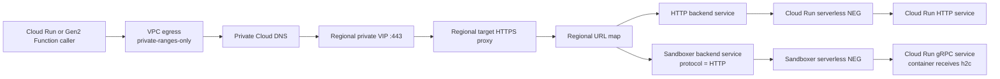

# The One-Line Protocol Setting That Broke Our Private gRPC Path on Cloud Run

*A practical guide to building a regional internal Application Load Balancer for serverless services on Google Cloud—and why a Cloud Run gRPC backend still needs `--protocol=HTTP`.*

## Why we built an internal Application Load Balancer

Cloud Run makes it pleasantly easy to deploy a service. The harder question appears later: how should a growing set of services call one another without turning generated `run.app` URLs into permanent application contracts?

Consider a platform with a database API, token service, sandbox execution service, internal dashboard and review service. Their generated Cloud Run addresses work, but they create a few problems:

- Callers become coupled to deployment-generated hostnames.
- Moving or replacing a service requires changing every caller.
- There is no shared host-based routing layer.
- Private certificate policy is difficult to centralize.
- Public and private traffic paths can become mixed together.

We wanted callers to use stable names such as:

```text
db-api.internal.example.com
token-service.internal.example.com
sandboxer.internal.example.com:443
grafana.internal.example.com
default-review.internal.example.com
```

The resulting path was:



An internal Application Load Balancer is still a Layer 7 proxy. It terminates TLS, evaluates the request hostname and path, and selects a regional backend service. Google describes it as a proxy-based Layer 7 load balancer that provides a single internal IP for HTTP and HTTPS services, including Cloud Run through serverless network endpoint groups (NEGs).

Official documentation: [Internal Application Load Balancer overview](https://cloud.google.com/load-balancing/docs/l7-internal)

## What the design gives you

### Stable private service names

Instead of placing an address like this in application configuration:

```text
https://db-api-abcdef-uc.a.run.app
```

callers use a service-owned name:

```text
https://db-api.internal.example.com
```

The name can remain stable while the underlying Cloud Run service, NEG or deployment strategy changes.

### Host-based service routing

A single private VIP can serve multiple applications:

| Hostname | Cloud Run backend |
|---|---|
| `db-api.internal.example.com` | `db-api-server` |
| `token-service.internal.example.com` | `token-service` |
| `sandboxer.internal.example.com:443` | `sandboxer` |
| `grafana.internal.example.com` | `grafana` |
| `default-review.internal.example.com` | `default-review` |

The URL map becomes a small internal service directory at the networking layer.

### Central TLS termination

The regional HTTPS proxy owns the serving certificate. Certificate Manager can obtain and rotate a regional Google-managed certificate from a private Certificate Authority Service pool. No private key needs to be generated locally or copied into source control.

The CA pool, issuance configuration and regional certificate must use the same location. See [Deploy a regional Google-managed certificate with CA Service](https://cloud.google.com/certificate-manager/docs/deploy-google-managed-cas-regional).

### Separate private and public egress

A Cloud Run caller using `private-ranges-only` sends traffic for an RFC 1918 internal VIP through its VPC connection. Normal public traffic still uses the standard Cloud Run internet path. GitHub and GitLab traffic therefore does not need to pass through the internal load balancer or an explicit web proxy merely because internal service traffic does.

Official documentation: [Configure Serverless VPC Access egress](https://cloud.google.com/run/docs/configuring/vpc-connectors)

## Before running any command

The commands below create billable infrastructure and are deliberately written with variables. Run them from Bash or Google Cloud Shell after reviewing every value.

They show the Google Cloud CLI equivalent of the architecture. In a real environment, keep Terraform or another infrastructure-as-code system as the source of truth. Do not use these commands to create resources that Terraform already manages; use them as an implementation reference or for a clean demonstration project.

Set the example values:

```bash
export PROJECT_ID="my-serverless-project"
export REGION="us-central1"
export NETWORK="services-vpc"
export CLIENT_SUBNET="services-private-subnet"
export CLIENT_SUBNET_RANGE="10.20.0.0/20"
export PROXY_SUBNET="services-proxy-only-subnet"
export PROXY_SUBNET_RANGE="10.20.240.0/23"

export PRIVATE_ZONE="internal-example-com"
export PRIVATE_DOMAIN="internal.example.com."

export VIP_NAME="internal-services-vip"
export URL_MAP="internal-services-map"
export HTTPS_PROXY="internal-services-https-proxy"
export FORWARDING_RULE="internal-services-https"

export CA_POOL="internal-services-ca-pool"
export ROOT_CA="internal-services-root-2026"
export ISSUANCE_CONFIG="internal-services-issuance"
export CERTIFICATE_NAME="internal-services-certificate"
export TRUST_BUNDLE_SECRET="internal-services-ca-bundle"

gcloud config set project "${PROJECT_ID}"
```

Confirm that the active account and project are correct before continuing:

```bash
gcloud auth list
gcloud config get-value project
gcloud projects describe "${PROJECT_ID}" \
  --format='yaml(projectId,projectNumber,name)'
```

## Step 1: Enable the required APIs

```bash
gcloud services enable \
  compute.googleapis.com \
  run.googleapis.com \
  dns.googleapis.com \
  privateca.googleapis.com \
  certificatemanager.googleapis.com \
  secretmanager.googleapis.com \
  vpcaccess.googleapis.com \
  --project="${PROJECT_ID}"
```

Enabling an API is a project-level operation. Do it once through the system that owns project APIs rather than attaching API enablement to every service deployment.

## Step 2: Inspect existing networking and DNS

Do not create a second proxy-only subnet or a conflicting private DNS namespace.

```bash
gcloud compute networks describe "${NETWORK}" \
  --project="${PROJECT_ID}" \
  --format='yaml(name,selfLink,subnetworks)'

gcloud compute networks subnets list \
  --project="${PROJECT_ID}" \
  --filter="network:${NETWORK} AND region:(${REGION})" \
  --format='table(name,region.basename(),ipCidrRange,purpose,role)'

gcloud dns managed-zones list \
  --project="${PROJECT_ID}" \
  --filter='visibility=private' \
  --format='table(name,dnsName,visibility,privateVisibilityConfig.networks.networkUrl)'
```

Also inspect DNS peering and any connected VPC namespace before choosing the private suffix. A private zone does not need public delegation, Cloudflare records or public DNS authorization.

## Step 3: Create the VPC and subnets when they do not already exist

Create the custom-mode VPC only for a clean example project:

```bash
gcloud compute networks create "${NETWORK}" \
  --project="${PROJECT_ID}" \
  --subnet-mode=custom
```

Create the client subnet. The private frontend VIP will be reserved from this subnet:

```bash
gcloud compute networks subnets create "${CLIENT_SUBNET}" \
  --project="${PROJECT_ID}" \
  --network="${NETWORK}" \
  --region="${REGION}" \
  --range="${CLIENT_SUBNET_RANGE}" \
  --enable-private-ip-google-access
```

Create one active proxy-only subnet for regional Envoy-based load balancers in this VPC and region:

```bash
gcloud compute networks subnets create "${PROXY_SUBNET}" \
  --project="${PROJECT_ID}" \
  --network="${NETWORK}" \
  --region="${REGION}" \
  --range="${PROXY_SUBNET_RANGE}" \
  --purpose=REGIONAL_MANAGED_PROXY \
  --role=ACTIVE
```

The proxy-only subnet is used by Google-managed proxies. Do not reserve the load balancer VIP from it. Google’s setup example uses a `/23`, but the correct range must be selected from the actual VPC address plan.

Official documentation: [Set up a regional internal Application Load Balancer with Cloud Run](https://cloud.google.com/load-balancing/docs/l7-internal/setting-up-l7-internal-serverless)

## Step 4: Prepare the Cloud Run services

This example assumes the HTTP services already exist. The sandboxer service must accept HTTP/2 because it serves gRPC:

```bash
gcloud run services update sandboxer \
  --project="${PROJECT_ID}" \
  --region="${REGION}" \
  --use-http2 \
  --ingress=internal
```

`--use-http2` configures Cloud Run to deliver HTTP/2 cleartext, or h2c, to the container. The container must actually speak h2c on its configured `PORT`; changing the Cloud Run setting cannot make an HTTP/1-only application into a gRPC server.

Google’s frontend terminates TLS and forwards native gRPC traffic to the container using h2c over Google’s encrypted infrastructure. See [Use HTTP/2 for Cloud Run services](https://cloud.google.com/run/docs/configuring/http2).

Restrict the other internal targets as appropriate:

```bash
for service in db-api-server token-service grafana default-review; do
  gcloud run services update "${service}" \
    --project="${PROJECT_ID}" \
    --region="${REGION}" \
    --ingress=internal
done
```

If a service must also receive traffic from an external Application Load Balancer, use `internal-and-cloud-load-balancing` instead. Do not broaden ingress to `all` merely to make the serverless NEG work. Ingress restrictions also do not replace IAM or application authentication.

Official documentation: [Restrict Cloud Run ingress](https://cloud.google.com/run/docs/securing/ingress)

## Step 5: Create the private CA and managed certificate

### Choose the CA tier deliberately

The DevOps tier is intended for high-volume, short-lived microservice certificates. Enterprise adds features such as certificate tracking, revocation and customer-managed CA keys, at a higher base cost. The tier cannot be changed after the pool is created.

For this internal service example, create a DevOps pool explicitly. Omitting `--tier` defaults to Enterprise, which can introduce an unintended cost increase.

```bash
gcloud privateca pools create "${CA_POOL}" \
  --project="${PROJECT_ID}" \
  --location="${REGION}" \
  --tier=devops
```

Official documentation: [CA Service tiers](https://cloud.google.com/certificate-authority-service/docs/tiers) and [CA Service pricing](https://cloud.google.com/certificate-authority-service/pricing)

Create and enable a Google-managed root CA:

```bash
gcloud privateca roots create "${ROOT_CA}" \
  --project="${PROJECT_ID}" \
  --location="${REGION}" \
  --pool="${CA_POOL}" \
  --subject="CN=Internal Services Root 2026,O=Example" \
  --key-algorithm=rsa-pkcs1-2048-sha256 \
  --validity=P10Y \
  --auto-enable
```

For a mature production PKI, consider an offline or tightly controlled root with an issuing subordinate CA. The direct root shown here keeps the serverless example readable; it should not be mistaken for a universal PKI design.

### Let Certificate Manager request certificates

Create the Certificate Manager service identity and grant it requester access on this CA pool:

```bash
gcloud beta services identity create \
  --service=certificatemanager.googleapis.com \
  --project="${PROJECT_ID}"

export PROJECT_NUMBER="$(
  gcloud projects describe "${PROJECT_ID}" \
    --format='value(projectNumber)'
)"

export CERTIFICATE_MANAGER_SERVICE_AGENT="service-${PROJECT_NUMBER}@gcp-sa-certificatemanager.iam.gserviceaccount.com"

gcloud privateca pools add-iam-policy-binding "${CA_POOL}" \
  --project="${PROJECT_ID}" \
  --location="${REGION}" \
  --member="serviceAccount:${CERTIFICATE_MANAGER_SERVICE_AGENT}" \
  --role=roles/privateca.certificateRequester
```

The full CA pool resource name is required by the issuance configuration:

```bash
export CA_POOL_RESOURCE="projects/${PROJECT_ID}/locations/${REGION}/caPools/${CA_POOL}"

gcloud certificate-manager issuance-configs create "${ISSUANCE_CONFIG}" \
  --project="${PROJECT_ID}" \
  --location="${REGION}" \
  --ca-pool="${CA_POOL_RESOURCE}" \
  --lifetime=P30D \
  --rotation-window-percentage=66 \
  --key-algorithm=rsa-2048
```

Certificate Manager permits a 21-to-30-day lifetime for certificates issued through an issuance configuration. A 30-day certificate with renewal beginning at 66% leaves enough time on both sides of Google’s seven-day renewal constraints.

Create one regional Google-managed certificate with explicit SANs:

```bash
gcloud certificate-manager certificates create "${CERTIFICATE_NAME}" \
  --project="${PROJECT_ID}" \
  --location="${REGION}" \
  --issuance-config="${ISSUANCE_CONFIG}" \
  --domains="db-api.internal.example.com,token-service.internal.example.com,sandboxer.internal.example.com,grafana.internal.example.com,default-review.internal.example.com"
```

Wait until it is active before attaching it to the HTTPS proxy:

```bash
gcloud certificate-manager certificates describe "${CERTIFICATE_NAME}" \
  --project="${PROJECT_ID}" \
  --location="${REGION}" \
  --format='yaml(name,managed.state,managed.domains,sanDnsnames,expireTime)'
```

Certificate Manager generates and rotates the leaf certificate’s private key. Never export or distribute that key.

## Step 6: Export and distribute only the public CA bundle

Clients do not automatically trust a new private CA. Export the public root certificate:

```bash
export CA_BUNDLE_FILE="${PWD}/internal-services-ca-bundle.pem"

gcloud privateca roots describe "${ROOT_CA}" \
  --project="${PROJECT_ID}" \
  --location="${REGION}" \
  --pool="${CA_POOL}" \
  --format='value(pemCaCertificates)' > "${CA_BUNDLE_FILE}"

openssl x509 \
  -in "${CA_BUNDLE_FILE}" \
  -noout \
  -subject \
  -issuer \
  -fingerprint \
  -sha256
```

Create a Secret Manager secret containing only the public trust bundle:

```bash
gcloud secrets create "${TRUST_BUNDLE_SECRET}" \
  --project="${PROJECT_ID}" \
  --replication-policy=automatic \
  --data-file="${CA_BUNDLE_FILE}"
```

For each caller, grant its runtime service account access:

```bash
export CALLER_SERVICE="review-worker"
export CALLER_SERVICE_ACCOUNT="review-worker@${PROJECT_ID}.iam.gserviceaccount.com"

gcloud secrets add-iam-policy-binding "${TRUST_BUNDLE_SECRET}" \
  --project="${PROJECT_ID}" \
  --member="serviceAccount:${CALLER_SERVICE_ACCOUNT}" \
  --role=roles/secretmanager.secretAccessor
```

Mount the bundle into the caller and tell Node.js to load it when the process starts:

```bash
gcloud run services update "${CALLER_SERVICE}" \
  --project="${PROJECT_ID}" \
  --region="${REGION}" \
  --update-secrets="/var/run/secrets/internal-ca/ca-bundle.pem=${TRUST_BUNDLE_SECRET}:latest" \
  --update-env-vars="NODE_EXTRA_CA_CERTS=/var/run/secrets/internal-ca/ca-bundle.pem"
```

`NODE_EXTRA_CA_CERTS` is a Node.js runtime variable, not an application-defined name. Node reads it when the process starts, so the file must be mounted before startup. If a service constructs custom gRPC credentials, an HTTPS agent or an Undici dispatcher, confirm whether that client uses Node’s process trust store or requires CA bytes explicitly.

Never use `NODE_TLS_REJECT_UNAUTHORIZED=0`.

Official documentation: [Mount Secret Manager secrets in Cloud Run](https://cloud.google.com/run/docs/configuring/services/secrets) and [Node.js `NODE_EXTRA_CA_CERTS`](https://nodejs.org/api/cli.html#node_extra_ca_certsfile)

Only callers need this bundle. A service that merely receives traffic through its NEG does not need the CA certificate unless it also initiates a connection to another private hostname.

## Step 7: Create the serverless NEGs and backend services

The example creates five Cloud Run serverless NEGs:

```bash
declare -A CLOUD_RUN_SERVICES=(
  [db-api]="db-api-server"
  [token-service]="token-service"
  [sandboxer]="sandboxer"
  [grafana]="grafana"
  [default-review]="default-review"
)

for key in "${!CLOUD_RUN_SERVICES[@]}"; do
  gcloud compute network-endpoint-groups create "${key}-internal-neg" \
    --project="${PROJECT_ID}" \
    --region="${REGION}" \
    --network-endpoint-type=serverless \
    --cloud-run-service="${CLOUD_RUN_SERVICES[${key}]}"
done
```

Create a regional backend service for each NEG. Every one—including sandboxer—uses `HTTP`:

```bash
for key in "${!CLOUD_RUN_SERVICES[@]}"; do
  gcloud compute backend-services create "${key}-internal-backend" \
    --project="${PROJECT_ID}" \
    --region="${REGION}" \
    --load-balancing-scheme=INTERNAL_MANAGED \
    --protocol=HTTP

  gcloud compute backend-services add-backend "${key}-internal-backend" \
    --project="${PROJECT_ID}" \
    --region="${REGION}" \
    --network-endpoint-group="${key}-internal-neg" \
    --network-endpoint-group-region="${REGION}"
done
```

Do not add VM health checks or proxy-subnet firewall rules for these serverless backends. Google routes traffic to serverless NEGs over special routes outside the VPC firewall path.

## The gRPC lesson: three protocol boundaries

Our original sandboxer backend used H2C because the application was gRPC. That sounded reasonable and was wrong.

The request crosses distinct boundaries:

```text
gRPC client
  -- HTTP/2 + TLS -->
Regional internal HTTPS frontend
  -- serverless NEG integration -->
Cloud Run frontend
  -- h2c over Google's encrypted infrastructure -->
Application container
```

### Client to load balancer

The client connects to:

```text
sandboxer.internal.example.com:443
```

It uses HTTP/2 over TLS. The certificate SAN contains `sandboxer.internal.example.com`, and the caller trusts the private CA.

### Backend service to the serverless NEG

The regional backend service uses:

```bash
gcloud compute backend-services create sandboxer-internal-backend \
  --project="${PROJECT_ID}" \
  --region="${REGION}" \
  --load-balancing-scheme=INTERNAL_MANAGED \
  --protocol=HTTP
```

Google’s Cloud Run serverless NEG guide is explicit: set `--protocol=HTTP`. The field is ignored for this serverless integration, but it is required because the CLI otherwise defaults to TCP.

The correction was conceptually simple:

```diff
- --protocol=H2C
+ --protocol=HTTP
```

### Cloud Run frontend to the container

Cloud Run remains configured with `--use-http2`, and the container still receives h2c. This does not conflict with the backend service using `HTTP`. The two settings control different boundaries.

That distinction was the most important lesson from the incident.

## Step 8: Create the regional URL map

Create the URL map with a safe default backend:

```bash
gcloud compute url-maps create "${URL_MAP}" \
  --project="${PROJECT_ID}" \
  --region="${REGION}" \
  --default-service="db-api-internal-backend"
```

Add a path matcher for each service:

```bash
for key in db-api token-service sandboxer grafana default-review; do
  gcloud compute url-maps add-path-matcher "${URL_MAP}" \
    --project="${PROJECT_ID}" \
    --region="${REGION}" \
    --path-matcher-name="${key}" \
    --default-service="${key}-internal-backend"
done
```

Add host rules. Include both the plain hostname and its `:443` form:

```bash
declare -A INTERNAL_HOSTS=(
  [db-api]="db-api.internal.example.com"
  [token-service]="token-service.internal.example.com"
  [sandboxer]="sandboxer.internal.example.com"
  [grafana]="grafana.internal.example.com"
  [default-review]="default-review.internal.example.com"
)

for key in "${!INTERNAL_HOSTS[@]}"; do
  host="${INTERNAL_HOSTS[${key}]}"

  gcloud compute url-maps add-host-rule "${URL_MAP}" \
    --project="${PROJECT_ID}" \
    --region="${REGION}" \
    --hosts="${host},${host}:443" \
    --path-matcher-name="${key}"
done
```

Why include the port? A gRPC client commonly sends an HTTP/2 `:authority` value such as `sandboxer.internal.example.com:443`. If the URL map matches only the hostname without the port, the request can fall through to the default backend. Google permits port numbers in host rules for Application Load Balancers.

Official documentation: [URL map concepts](https://cloud.google.com/load-balancing/docs/url-map-concepts)

## Step 9: Create the HTTPS frontend

Create the regional target HTTPS proxy and attach the regional Certificate Manager certificate directly:

```bash
gcloud compute target-https-proxies create "${HTTPS_PROXY}" \
  --project="${PROJECT_ID}" \
  --region="${REGION}" \
  --url-map="${URL_MAP}" \
  --certificate-manager-certificates="${CERTIFICATE_NAME}"
```

Certificate maps are not supported for this regional internal ALB path; the regional certificate is attached directly to the regional target HTTPS proxy.

Reserve an internal address from the normal client subnet:

```bash
gcloud compute addresses create "${VIP_NAME}" \
  --project="${PROJECT_ID}" \
  --region="${REGION}" \
  --subnet="${CLIENT_SUBNET}"

export INTERNAL_VIP="$(
  gcloud compute addresses describe "${VIP_NAME}" \
    --project="${PROJECT_ID}" \
    --region="${REGION}" \
    --format='value(address)'
)"

printf 'Reserved internal VIP: %s\n' "${INTERNAL_VIP}"
```

Create the forwarding rule:

```bash
gcloud compute forwarding-rules create "${FORWARDING_RULE}" \
  --project="${PROJECT_ID}" \
  --region="${REGION}" \
  --load-balancing-scheme=INTERNAL_MANAGED \
  --network="${NETWORK}" \
  --subnet="${CLIENT_SUBNET}" \
  --address="${VIP_NAME}" \
  --ports=443 \
  --target-https-proxy="${HTTPS_PROXY}" \
  --target-https-proxy-region="${REGION}"
```

Keep these resources separate from Layer 4 forwarding rules that use `INTERNAL`. `INTERNAL` and `INTERNAL_MANAGED` represent different load-balancer families.

## Step 10: Create private DNS

Create a private zone associated only with the intended VPC:

```bash
gcloud dns managed-zones create "${PRIVATE_ZONE}" \
  --project="${PROJECT_ID}" \
  --description="Private names for regional internal services" \
  --dns-name="${PRIVATE_DOMAIN}" \
  --visibility=private \
  --networks="${NETWORK}"
```

Create one A record per internal hostname:

```bash
for hostname in \
  db-api.internal.example.com. \
  token-service.internal.example.com. \
  sandboxer.internal.example.com. \
  grafana.internal.example.com. \
  default-review.internal.example.com.; do
  gcloud dns record-sets create "${hostname}" \
    --project="${PROJECT_ID}" \
    --zone="${PRIVATE_ZONE}" \
    --type=A \
    --ttl=300 \
    --rrdatas="${INTERNAL_VIP}"
done
```

Only resources resolving through an authorized VPC can see these records. Public DNS delegation is neither required nor useful for this namespace.

Official documentation: [Create a private Cloud DNS zone](https://cloud.google.com/dns/docs/zones) and [Cloud DNS zone resolution](https://cloud.google.com/dns/docs/zones/zones-overview)

## Step 11: Connect callers to the VPC

If the caller uses a Serverless VPC Access connector, keep egress restricted to private ranges:

```bash
export VPC_CONNECTOR="services-vpc-connector"

gcloud run services update "${CALLER_SERVICE}" \
  --project="${PROJECT_ID}" \
  --region="${REGION}" \
  --vpc-connector="${VPC_CONNECTOR}" \
  --vpc-egress=private-ranges-only
```

Then update service endpoints while preserving their contracts:

```bash
gcloud run services update "${CALLER_SERVICE}" \
  --project="${PROJECT_ID}" \
  --region="${REGION}" \
  --update-env-vars="DB_API_URL=https://db-api.internal.example.com/trpc,TOKEN_SERVICE_ENDPOINT=https://token-service.internal.example.com,SANDBOXER_URL=sandboxer.internal.example.com:443,SANDBOXER_USE_TLS=true"
```

The shapes matter:

- `DB_API_URL` remains an HTTPS URL with the required `/trpc` suffix.
- `TOKEN_SERVICE_ENDPOINT` remains an HTTPS origin.
- `SANDBOXER_URL` remains a gRPC authority in `hostname:port` form.
- `SANDBOXER_USE_TLS` remains enabled.

Do not silently fall back to the public `run.app` endpoint after a certificate, DNS or gRPC failure.

## The 5,000 QPS limitation people miss

Google currently limits traffic sent to serverless NEGs through regional external and regional internal Application Load Balancers to **5,000 queries per second per project**.

The limit is:

- Not 5,000 QPS per Cloud Run service
- Not 5,000 QPS per NEG
- Not 5,000 QPS per load balancer
- Aggregated across all regional external and regional internal Application Load Balancers using serverless NEGs in the project

Official documentation: [Serverless NEG limitations](https://cloud.google.com/load-balancing/docs/negs/serverless-neg-concepts)

A shared internal ALB does not give each backend an independent allowance:

| Traffic source | Example peak QPS |
|---|---:|
| Database API | 1,800 |
| Token service | 700 |
| Sandboxer gRPC | 1,600 |
| Internal dashboards | 100 |
| Review service | 500 |
| Headroom | 300 |
| **Total** | **5,000** |

Cloud Run itself may be capable of scaling further while this regional serverless NEG path remains the bottleneck. Adding another regional internal load balancer in the same project does not create a second 5,000 QPS allowance.

If the expected peak approaches the limit, evaluate the architecture before rollout:

- Keep suitable service-to-service calls on direct Cloud Run endpoints.
- Separate workloads into projects when that boundary makes operational sense.
- Evaluate GKE, Compute Engine or other non-serverless NEG backends.
- Evaluate another supported load-balancer mode against its current limits.
- Measure actual request rates and leave failure headroom.

## Benefits

A regional internal ALB is a good fit when you need:

- Stable private hostnames
- Central TLS termination
- Host- or path-based routing
- One private service entry point
- Private access from Cloud Run, functions, VMs or connected networks
- Separation from public DNS
- Migration flexibility behind stable service names
- Consistent routing and logging policy

## Drawbacks

The design adds a meaningful control plane:

- Proxy-only subnet
- Private VIP
- Forwarding rule
- Regional target HTTPS proxy
- URL map
- Backend services
- Serverless NEGs
- Private DNS
- Certificate Manager
- CA Service
- Client trust distribution

It also introduces regional coupling, private CA rotation work, a project-wide serverless NEG QPS ceiling and several layers to debug.

A failed request can originate in DNS, VPC routing, certificate trust, SAN matching, URL-map routing, Cloud Run ingress, IAM, application authentication, gRPC transport or the application itself.

## Validation from a workload inside the VPC

### Inspect the live backend and NEG

```bash
gcloud compute backend-services describe sandboxer-internal-backend \
  --project="${PROJECT_ID}" \
  --region="${REGION}" \
  --format='yaml(name,protocol,loadBalancingScheme,backends)'

gcloud compute network-endpoint-groups describe sandboxer-internal-neg \
  --project="${PROJECT_ID}" \
  --region="${REGION}" \
  --format='yaml(name,networkEndpointType,cloudRun)'
```

Expected facts:

```yaml
backendService:
  loadBalancingScheme: INTERNAL_MANAGED
  protocol: HTTP
networkEndpointGroup:
  networkEndpointType: SERVERLESS
  cloudRun:
    service: sandboxer
```

The NEG itself has no HTTP or H2C protocol. The regional backend service carries the `HTTP` value.

### Inspect host routing

```bash
gcloud compute url-maps describe "${URL_MAP}" \
  --project="${PROJECT_ID}" \
  --region="${REGION}" \
  --format='yaml(hostRules,pathMatchers)'
```

Confirm the sandboxer host rule contains both:

```text
sandboxer.internal.example.com
sandboxer.internal.example.com:443
```

### Test DNS

```bash
dig +short sandboxer.internal.example.com
```

The answer must be the private VIP.

### Test TLS and SAN validation

```bash
openssl s_client \
  -connect sandboxer.internal.example.com:443 \
  -servername sandboxer.internal.example.com \
  -CAfile /var/run/secrets/internal-ca/ca-bundle.pem \
  -verify_return_error </dev/null
```

The certificate chain must validate and the certificate must contain the requested hostname as a SAN.

### Test real gRPC

```bash
grpcurl \
  -cacert /var/run/secrets/internal-ca/ca-bundle.pem \
  sandboxer.internal.example.com:443 \
  list
```

If server reflection is disabled, invoke a known authenticated method with the required protobuf descriptors and authorization metadata. A successful TLS handshake alone does not prove that the URL map selected the right backend or that the application processed a gRPC request.

### Test the HTTP APIs

```bash
curl \
  --fail-with-body \
  --cacert /var/run/secrets/internal-ca/ca-bundle.pem \
  https://db-api.internal.example.com/trpc

curl \
  --fail-with-body \
  --cacert /var/run/secrets/internal-ca/ca-bundle.pem \
  https://token-service.internal.example.com/
```

Use the real authentication headers required by each application. The `/trpc` check should return the expected API response, not a generic HTML error page from the wrong backend.

## Trust rotation without an outage

CA rotation should be an overlap, not a replacement event.

1. Create and enable the new CA.
2. Build a bundle containing both old and new public CA certificates.
3. Add that bundle as a new Secret Manager version.
4. Roll callers so every new instance trusts both CAs.
5. Issue or rotate the serving certificate from the new CA.
6. Verify all callers.
7. Remove the old CA from the bundle only after the old serving chain is no longer used.

Add a new trust-bundle version with:

```bash
gcloud secrets versions add "${TRUST_BUNDLE_SECRET}" \
  --project="${PROJECT_ID}" \
  --data-file="${CA_BUNDLE_FILE}"
```

Because Node reads `NODE_EXTRA_CA_CERTS` at process startup, roll the caller revisions or instances after changing the bundle. Do not assume an already-running process reloads the file.

## A rollout sequence that avoids guesswork

1. Inspect or import the existing proxy-only subnet.
2. Create the CA pool and enabled CA.
3. Create the issuance configuration and regional managed certificate.
4. Distribute the public trust bundle before changing endpoints.
5. Confirm callers start with the mounted bundle.
6. Create the VIP, serverless NEGs, backend services, URL map, HTTPS proxy and forwarding rule.
7. Create the private DNS zone and records.
8. Test DNS, TLS and every host from inside the VPC.
9. Test a real sandboxer gRPC request.
10. Move one canary caller to the private endpoints.
11. Verify normal public GitHub and GitLab traffic remains direct.
12. Migrate the remaining callers.
13. Keep the previous environment values available through revision rollback, without adding a permanent endpoint fallback.

## Final takeaway

The failure came from a small but important assumption:

```diff
- --protocol=H2C
+ --protocol=HTTP
```

“gRPC uses HTTP/2” does not mean every configurable hop should be marked H2C.

With a regional internal Application Load Balancer and a Cloud Run serverless NEG:

- The client uses gRPC over HTTP/2 and TLS.
- The regional HTTPS proxy terminates TLS.
- The serverless NEG backend service is configured with `HTTP`.
- The NEG points to the Cloud Run service.
- Cloud Run remains configured to deliver h2c to the container.
- The URL map accounts for a gRPC authority containing `:443`.

Once those boundaries are treated separately, the design becomes easier to operate—and much less tempting to repair with the wrong protocol setting.

## Official references

- [Internal Application Load Balancer overview](https://cloud.google.com/load-balancing/docs/l7-internal)
- [Set up a regional internal Application Load Balancer with Cloud Run](https://cloud.google.com/load-balancing/docs/l7-internal/setting-up-l7-internal-serverless)
- [Serverless NEG concepts and limitations](https://cloud.google.com/load-balancing/docs/negs/serverless-neg-concepts)
- [Cloud Run HTTP/2 and gRPC configuration](https://cloud.google.com/run/docs/configuring/http2)
- [Cloud Run ingress restrictions](https://cloud.google.com/run/docs/securing/ingress)
- [Cloud Run VPC connector egress](https://cloud.google.com/run/docs/configuring/vpc-connectors)
- [URL map concepts](https://cloud.google.com/load-balancing/docs/url-map-concepts)
- [Regional Google-managed certificates with CA Service](https://cloud.google.com/certificate-manager/docs/deploy-google-managed-cas-regional)
- [Certificate issuance configurations](https://cloud.google.com/certificate-manager/docs/issuance-configs)
- [CA Service operation tiers](https://cloud.google.com/certificate-authority-service/docs/tiers)
- [Private Cloud DNS zones](https://cloud.google.com/dns/docs/zones)
- [Cloud Run Secret Manager mounts](https://cloud.google.com/run/docs/configuring/services/secrets)
- [Node.js `NODE_EXTRA_CA_CERTS`](https://nodejs.org/api/cli.html#node_extra_ca_certsfile)
