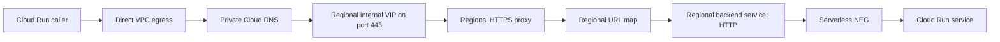

Generated `run.app` URLs are stable enough for many Cloud Run integrations, but they are not always the right internal service contract. A platform may need private DNS, one HTTPS entry point, host-based routing, or a controlled migration boundary between callers and several serverless backends.

A regional internal Application Load Balancer (ALB) provides that Layer 7 entry point on a private Virtual Private Cloud (VPC) address. This guide builds the path for one Cloud Run service and explains how to extend it safely. It focuses on the load balancer rather than creating a private certificate authority. The commands were reviewed against Google Cloud documentation on August 31, 2026 and must be tested in a non-production project because the network, load balancer, certificate, DNS, and Cloud Run changes can incur cost or interrupt traffic.

## Decide whether the load balancer is justified

Use this design when callers need one or more of these capabilities:

- a private IP address reachable through a VPC or connected network;
- a service-owned hostname such as `orders.internal.example.com`;
- centralized TLS termination and certificate rotation;
- host- or path-based routing across multiple Cloud Run services; or
- a stable endpoint while backends change.

Keep direct Cloud Run calls when none of those requirements exists. The internal ALB adds a proxy-only subnet, forwarding rule, target proxy, URL map, backend service, serverless network endpoint group (NEG), private DNS, certificate lifecycle, logs, quotas, and another failure domain. It is an infrastructure boundary, not a free alias for `run.app`.

This example is regional. The serverless NEG and Cloud Run service must be in the same region, and the backend service can contain only one serverless NEG. Use a cross-region design when regional failover is a requirement; do not imply high availability across regions by adding more records to this topology.

## Request path

The Cloud Run caller sends private-address traffic through Direct VPC egress. Private Cloud DNS resolves the service name to the load balancer's regional virtual IP (VIP). The HTTPS proxy terminates TLS, the URL map selects a backend, and a serverless NEG identifies the Cloud Run service.



Traffic between the load balancer and a serverless NEG uses Google-managed special routes outside the VPC firewall path. If every backend is serverless, do not create a firewall allow rule from the proxy-only subnet to Cloud Run. The proxy-only subnet is still required for the regional Envoy-based load balancer.

## Prerequisites

Prepare the following before creating resources:

- a custom-mode VPC and normal client subnet;
- no conflicting active proxy-only subnet in the VPC and region;
- an existing Cloud Run service in the target project and region;
- a regional Certificate Manager certificate covering the internal hostname;
- client trust for the certificate's issuing authority;
- a private DNS namespace associated with the intended VPC; and
- an explicit Cloud Run authentication design.

Network ingress and application authentication are separate. An internal path does not make unauthenticated application access appropriate. Keep Cloud Run IAM or application-level authentication unless the service's threat model deliberately permits otherwise.

Use placeholders and confirm the active project before any state-changing command:

```bash
export PROJECT_ID="example-project"
export REGION="us-central1"
export NETWORK="services-vpc"
export CLIENT_SUBNET="services-subnet"
export PROXY_SUBNET="services-proxy-only"
export PROXY_RANGE="10.20.240.0/23"

export SERVICE="orders-api"
export NEG="orders-api-neg"
export BACKEND="orders-api-backend"
export URL_MAP="internal-services-map"
export HTTPS_PROXY="internal-services-https-proxy"
export VIP="internal-services-vip"
export FORWARDING_RULE="internal-services-https"
export CERTIFICATE="internal-services-certificate"
export HOSTNAME="orders.internal.example.com"

gcloud config set project "$PROJECT_ID"
gcloud config get-value project
```

## Implementation

### Inspect regional network resources

Check address ranges and existing managed-proxy subnets before creating another one:

```bash
gcloud compute networks subnets list \
  --filter="network:$NETWORK AND region:($REGION)" \
  --format="table(name,region.basename(),ipCidrRange,purpose,role)"
```

If the VPC and region do not already have an appropriate active proxy-only subnet, create one from the approved address plan:

```bash
gcloud compute networks subnets create "$PROXY_SUBNET" \
  --network="$NETWORK" \
  --region="$REGION" \
  --range="$PROXY_RANGE" \
  --purpose=REGIONAL_MANAGED_PROXY \
  --role=ACTIVE
```

Do not allocate the frontend VIP from this subnet. Regional proxy-only subnets are shared by compatible Envoy-based load balancers in the VPC and region, so manage them as network infrastructure rather than application-owned resources.

### Restrict the Cloud Run ingress path

Traffic from a regional internal Application Load Balancer is accepted by a Cloud Run service whose ingress is `internal`:

```bash
gcloud run services update "$SERVICE" \
  --region="$REGION" \
  --ingress=internal
```

Current Cloud Run also supports disabling the default `run.app` endpoint:

```bash
gcloud run services update "$SERVICE" \
  --region="$REGION" \
  --no-default-url
```

Disabling that endpoint is a stronger way to require the load-balanced path, but it can break Cloud Scheduler, Cloud Tasks, Eventarc, Pub/Sub, Workflows, uptime checks, and other products that invoke the default URL. Inventory every caller and migrate it before applying `--no-default-url`. Preserve IAM checks even after the endpoint is disabled.

For a gRPC service, also configure Cloud Run to deliver end-to-end HTTP/2 to the container:

```bash
gcloud run services update "$SERVICE" \
  --region="$REGION" \
  --use-http2
```

The container must actually serve h2c on its injected `PORT`. This flag cannot turn an HTTP/1 application into a gRPC server.

### Create the serverless NEG and backend service

Create a regional serverless NEG that points to the Cloud Run service:

```bash
gcloud compute network-endpoint-groups create "$NEG" \
  --region="$REGION" \
  --network-endpoint-type=serverless \
  --cloud-run-service="$SERVICE"
```

The backend service protocol must be `HTTP`, including when the application serves gRPC:

```bash
gcloud compute backend-services create "$BACKEND" \
  --region="$REGION" \
  --load-balancing-scheme=INTERNAL_MANAGED \
  --protocol=HTTP \
  --enable-logging

gcloud compute backend-services add-backend "$BACKEND" \
  --region="$REGION" \
  --network-endpoint-group="$NEG" \
  --network-endpoint-group-region="$REGION"
```

Google documents `--protocol=HTTP` as required for this serverless integration even though the value is ignored after configuration; without it, the CLI defaults to TCP, which is not valid for the Application Load Balancer backend. Do not attach a VM health check or set a balancing mode. Neither is supported for a regional serverless NEG backend.

### Build the regional HTTPS frontend

Create a URL map with the service as its default backend:

```bash
gcloud compute url-maps create "$URL_MAP" \
  --region="$REGION" \
  --default-service="$BACKEND"
```

Attach the existing regional Certificate Manager certificate directly to a regional HTTPS proxy:

```bash
gcloud compute target-https-proxies create "$HTTPS_PROXY" \
  --region="$REGION" \
  --url-map="$URL_MAP" \
  --certificate-manager-certificates="$CERTIFICATE"
```

Certificate maps are not the attachment method for this load balancer type. The certificate, target proxy, URL map, backend service, NEG, and Cloud Run service must use compatible regional scope. A privately issued certificate also requires every caller to trust its public CA chain.

Reserve the VIP from the normal client subnet and create the forwarding rule:

```bash
gcloud compute addresses create "$VIP" \
  --region="$REGION" \
  --subnet="$CLIENT_SUBNET"

gcloud compute forwarding-rules create "$FORWARDING_RULE" \
  --region="$REGION" \
  --load-balancing-scheme=INTERNAL_MANAGED \
  --network="$NETWORK" \
  --subnet="$CLIENT_SUBNET" \
  --address="$VIP" \
  --ports=443 \
  --target-https-proxy="$HTTPS_PROXY" \
  --target-https-proxy-region="$REGION"
```

`INTERNAL_MANAGED` identifies the Layer 7 load balancer family. Do not substitute the `INTERNAL` scheme used by different Layer 4 products.

### Publish the private DNS record

Read the assigned address:

```bash
INTERNAL_VIP="$(gcloud compute addresses describe "$VIP" \
  --region="$REGION" \
  --format='value(address)')"

printf 'Internal VIP: %s\n' "$INTERNAL_VIP"
```

Create an `A` record in an existing private zone associated with the VPC:

```bash
export PRIVATE_ZONE="internal-example-com"

gcloud dns record-sets create "${HOSTNAME}." \
  --zone="$PRIVATE_ZONE" \
  --type=A \
  --ttl=300 \
  --rrdatas="$INTERNAL_VIP"
```

Public delegation is not required for a private zone. Check overlapping private zones, DNS peering, and forwarding policies before deciding that a missing response is a load balancer problem.

### Connect a Cloud Run caller to the VPC

Direct VPC egress can send only private-address traffic through the VPC while public traffic retains its normal route:

```bash
export CALLER="orders-worker"

gcloud run services update "$CALLER" \
  --region="$REGION" \
  --network="$NETWORK" \
  --subnet="$CLIENT_SUBNET" \
  --vpc-egress=private-ranges-only
```

Update the caller's endpoint only after DNS, certificate trust, authentication, and a real request have passed from a canary revision. Do not build a permanent silent fallback to the public URL; it hides failures in the private path and defeats the routing policy.

## The gRPC protocol boundary

The phrase "gRPC uses HTTP/2" does not mean every protocol field in the path should be `HTTP2` or `H2C`. Three boundaries are involved:

```text
gRPC client
  -- HTTP/2 with TLS -->
regional internal HTTPS proxy
  -- serverless NEG integration with backend protocol HTTP -->
Cloud Run frontend
  -- h2c over Google's encrypted infrastructure -->
application container
```

The client uses an HTTPS authority such as `orders.internal.example.com:443`. The regional backend service is configured with `HTTP` because that is the required serverless NEG setting. Separately, `--use-http2` tells Cloud Run to preserve HTTP/2 to a container that speaks h2c.

For multiple services behind one URL map, test the exact gRPC `:authority` value. Application Load Balancer host rules can contain port numbers, so a map may need both `service.internal.example.com` and `service.internal.example.com:443` to prevent a request from falling through to the default backend.

## Verify the result

Run the tests from a workload that uses the intended VPC and private DNS path.

Confirm resource scope and the required protocol:

```bash
gcloud compute backend-services describe "$BACKEND" \
  --region="$REGION" \
  --format='yaml(name,protocol,loadBalancingScheme,backends,logConfig)'

gcloud compute network-endpoint-groups describe "$NEG" \
  --region="$REGION" \
  --format='yaml(name,networkEndpointType,cloudRun)'
```

Expected signals are `INTERNAL_MANAGED`, backend protocol `HTTP`, NEG type `SERVERLESS`, and the intended Cloud Run service name.

Verify DNS and TLS identity:

```bash
dig +short "$HOSTNAME"

openssl s_client \
  -connect "${HOSTNAME}:443" \
  -servername "$HOSTNAME" \
  -CAfile ./internal-ca-bundle.pem \
  -verify_return_error </dev/null
```

The DNS answer must be the private VIP, and the certificate must validate for the requested hostname. Then send an authenticated application request. For gRPC, use a known method or server reflection when it is deliberately enabled:

```bash
grpcurl \
  -cacert ./internal-ca-bundle.pem \
  "${HOSTNAME}:443" \
  list
```

A successful TLS handshake does not prove that the URL map selected the correct backend or that Cloud Run authorized and processed the request. Check load balancer request logs and Cloud Run logs for the same request identifier.

## Failure modes

### DNS returns no address or the wrong VIP

Check which private zone is authoritative from the caller's VPC, including peering and forwarding. Confirm the record has a trailing-dot fully qualified name and that the caller is attached to the expected network.

### TLS succeeds but the application returns the wrong response

Inspect URL-map host rules and the client's HTTP host or gRPC authority. A request that matches no host rule reaches the map's default backend.

### The load balancer returns a server error

Verify the NEG points to the correct service in the same project and region. Serverless NEG backends do not use ordinary health checks, so the load balancer can continue routing to an application that returns errors. Test Cloud Run readiness and revisions before changing traffic.

### Direct `run.app` access still works

`--ingress=internal` controls accepted network sources, while `--no-default-url` disables the endpoint itself. Confirm both settings and remember that IAM still applies to every remaining ingress path.

## Rollback or cleanup

Keep the previous caller revision and endpoint configuration during rollout. If the private path fails, route the canary back to its last approved endpoint while preserving authentication. Re-enable the default Cloud Run URL only when a documented dependency requires it:

```bash
gcloud run services update "$SERVICE" \
  --region="$REGION" \
  --default-url
```

For a disposable environment, remove the DNS record, forwarding rule, reserved address, target proxy, URL map, backend service, serverless NEG, and application-owned certificate in dependency order. Delete the proxy-only subnet only when no other regional managed proxy uses it.

## Production considerations

Google currently documents a 5,000 queries-per-second limit per project for traffic sent to serverless NEGs through regional internal and regional external Application Load Balancers. The limit is aggregated across those regional load balancers rather than granted per service or per NEG. Measure peak traffic and contact Google Cloud support about quota options before the shared path approaches the limit.

A regional backend service accepts only one serverless NEG and does not support standard health checks. The design also concentrates DNS, certificate trust, routing, and regional availability in one path. Track request rate, latency, 4xx and 5xx responses, TLS expiry, Cloud Run revision health, and URL-map misses. Use a cross-region architecture when the availability requirement exceeds one region.

## Key takeaways

- Add a regional internal ALB only when private addressing or Layer 7 routing justifies its control plane.
- Use `--protocol=HTTP` on a Cloud Run serverless NEG backend, including for gRPC.
- Configure Cloud Run `--use-http2` separately when the container serves gRPC over h2c.
- Restrict ingress, consider disabling the default URL, and keep application authentication.
- Design against the regional serverless NEG QPS limit and the absence of ordinary health checks.

## References

- [Set up a regional internal Application Load Balancer with Cloud Run](https://cloud.google.com/load-balancing/docs/l7-internal/setting-up-l7-internal-serverless)
- [Serverless NEG concepts and limits](https://cloud.google.com/load-balancing/docs/negs/serverless-neg-concepts)
- [Use HTTP/2 with Cloud Run](https://cloud.google.com/run/docs/configuring/http2)
- [Restrict Cloud Run ingress and disable the default URL](https://cloud.google.com/run/docs/securing/ingress)
- [Configure Direct VPC egress](https://cloud.google.com/run/docs/configuring/vpc-direct-vpc)
- [Certificate Manager support by load balancer](https://cloud.google.com/certificate-manager/docs/overview)
- [URL map concepts](https://cloud.google.com/load-balancing/docs/url-map-concepts)
