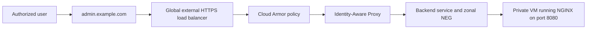

An internal administration page should not become public simply because a team needs browser access. On Google Cloud, Identity-Aware Proxy (IAP) can put an identity check in front of an application while the backend virtual machine remains without a public IP address.

This guide covers the security boundaries around that design: the global external Application Load Balancer, a private NGINX backend, restricted firewall ingress, IAP authorization, and an optional Cloud Armor policy. The commands target the current `gcloud` interface reviewed on August 31, 2026. Run them in a non-production project first because load balancers, public IP addresses, and certificates can incur charges.

## Prerequisites

You need a Google Cloud project with billing enabled and permission to manage Compute Engine, load balancing, firewall, IAP, and IAM resources. You also need:

- a domain that you can point to the load balancer;
- a VPC, subnet, and private VM with no external IP address;
- NGINX listening on port `8080` and returning HTTP `200` from `/healthz`;
- an organization-owned Google group for application access; and
- a controlled path for VM administration, such as OS Login through IAP TCP forwarding.

Use placeholders rather than copying production identifiers into a script:

```bash
export PROJECT_ID="example-project"
export ZONE="us-central1-a"
export NETWORK="app-vpc"
export SUBNET="app-subnet"
export VM_NAME="private-nginx"
export BACKEND_TAG="iap-nginx-backend"
export NEG_NAME="iap-nginx-neg"
export HEALTH_CHECK="iap-nginx-health"
export BACKEND_SERVICE="iap-nginx-backend"
export APP_DOMAIN="admin.example.com"
export ACCESS_GROUP="platform-admins@example.com"

gcloud config set project "$PROJECT_ID"
gcloud services enable compute.googleapis.com iap.googleapis.com
```

## How the request path works

The public endpoint belongs to the load balancer, not the VM. TLS terminates at the load balancer. Cloud Armor can reject unwanted traffic before IAP evaluates the user's identity. IAP then permits only principals with `roles/iap.httpsResourceAccessor`, and the load balancer forwards accepted requests to NGINX over the VPC.



For a global external Application Load Balancer, Cloud Armor is evaluated before IAP. Neither product repairs an exposed origin. The VM must have no external IP, and its application port must accept traffic only from the Google Front End (GFE) and health-check ranges required for this backend type.

## Implementation

### Confirm the backend is private and healthy

Check that the VM has no external address and that the expected network tag is attached:

```bash
gcloud compute instances describe "$VM_NAME" \
  --zone="$ZONE" \
  --format="yaml(name,tags.items,networkInterfaces.networkIP,networkInterfaces.accessConfigs)"
```

An empty `accessConfigs` value is the important signal. Apply the backend tag if it is missing:

```bash
gcloud compute instances add-tags "$VM_NAME" \
  --zone="$ZONE" \
  --tags="$BACKEND_TAG"
```

Do not add a temporary public IP to install NGINX. Build the package into an image, use an existing private software-delivery path, or provide controlled outbound access through Cloud NAT during provisioning.

### Restrict load balancer traffic to the application port

For a global external Application Load Balancer with a zonal `GCE_VM_IP_PORT` network endpoint group (NEG), Google documents `35.191.0.0/16` and `130.211.0.0/22` as the IPv4 source ranges used by health checks and GFE proxies. Allow only those ranges to port `8080` on tagged backends:

```bash
gcloud compute firewall-rules create allow-gfe-to-iap-nginx \
  --network="$NETWORK" \
  --direction=INGRESS \
  --priority=900 \
  --action=ALLOW \
  --rules=tcp:8080 \
  --source-ranges=35.191.0.0/16,130.211.0.0/22 \
  --target-tags="$BACKEND_TAG" \
  --enable-logging
```

The implied VPC ingress deny handles all other sources unless a broader allow rule already exists. Audit existing rules before relying on that boundary:

```bash
gcloud compute firewall-rules list \
  --filter="network:$NETWORK AND direction:INGRESS" \
  --format="table(name,priority,sourceRanges.list():label=SOURCE_RANGES,allowed[].map().firewall_rule().list():label=ALLOW,targetTags.list():label=TARGETS)"
```

### Register the VM endpoint

Create a health check and a zonal NEG. A zonal NEG is appropriate for this example because the endpoint is one VM IP and port, but a managed instance group is the better production choice when you need replacement, autoscaling, or multi-zone availability.

```bash
gcloud compute health-checks create http "$HEALTH_CHECK" \
  --global \
  --port=8080 \
  --request-path=/healthz \
  --enable-logging

gcloud compute network-endpoint-groups create "$NEG_NAME" \
  --zone="$ZONE" \
  --network="$NETWORK" \
  --subnet="$SUBNET" \
  --network-endpoint-type=GCE_VM_IP_PORT \
  --default-port=8080

VM_IP="$(gcloud compute instances describe "$VM_NAME" \
  --zone="$ZONE" \
  --format='value(networkInterfaces[0].networkIP)')"

gcloud compute network-endpoint-groups update "$NEG_NAME" \
  --zone="$ZONE" \
  --add-endpoint="instance=$VM_NAME,ip=$VM_IP,port=8080"
```

Create the backend service and attach the NEG:

```bash
gcloud compute backend-services create "$BACKEND_SERVICE" \
  --global \
  --load-balancing-scheme=EXTERNAL_MANAGED \
  --protocol=HTTP \
  --health-checks="$HEALTH_CHECK" \
  --enable-logging

gcloud compute backend-services add-backend "$BACKEND_SERVICE" \
  --global \
  --network-endpoint-group="$NEG_NAME" \
  --network-endpoint-group-zone="$ZONE" \
  --balancing-mode=RATE \
  --max-rate-per-endpoint=100
```

### Create the HTTPS frontend

Reserve a global address, create a Google-managed certificate, and build the URL map, HTTPS proxy, and forwarding rule:

```bash
gcloud compute addresses create iap-nginx-ip --global

gcloud compute ssl-certificates create iap-nginx-cert \
  --domains="$APP_DOMAIN" \
  --global

gcloud compute url-maps create iap-nginx-map \
  --default-service="$BACKEND_SERVICE"

gcloud compute target-https-proxies create iap-nginx-https-proxy \
  --url-map=iap-nginx-map \
  --ssl-certificates=iap-nginx-cert

gcloud compute forwarding-rules create iap-nginx-https-rule \
  --global \
  --load-balancing-scheme=EXTERNAL_MANAGED \
  --network-tier=PREMIUM \
  --address=iap-nginx-ip \
  --target-https-proxy=iap-nginx-https-proxy \
  --ports=443
```

Create the DNS `A` record only after checking the reserved address. Certificate provisioning begins after DNS points the hostname to the load balancer and can take time.

```bash
gcloud compute addresses describe iap-nginx-ip \
  --global \
  --format='value(address)'

gcloud compute ssl-certificates describe iap-nginx-cert \
  --global \
  --format='yaml(managed.status,managed.domainStatus)'
```

### Enable IAP and grant access

Enable IAP on the backend service. With no custom OAuth credentials supplied, current Google Cloud behavior uses a Google-managed OAuth client for browser access within the organization. External users, custom branding, and some programmatic access patterns require a separate design.

```bash
gcloud compute backend-services update "$BACKEND_SERVICE" \
  --global \
  --iap=enabled

gcloud iap web add-iam-policy-binding \
  --resource-type=backend-services \
  --service="$BACKEND_SERVICE" \
  --member="group:$ACCESS_GROUP" \
  --role="roles/iap.httpsResourceAccessor"
```

Grant access to a group rather than individual users so onboarding and removal stay auditable. Do not grant `allUsers` or `allAuthenticatedUsers`; either binding defeats the intended access boundary.

### Attach an approved Cloud Armor policy

Cloud Armor is optional for IAP authentication, but it can enforce network, geography, web application firewall, or rate-limit controls before a request reaches IAP. Reuse a reviewed organization policy instead of copying a host-header expression or an IAP callback exception from an unrelated application:

```bash
export SECURITY_POLICY="approved-web-policy"

gcloud compute backend-services update "$BACKEND_SERVICE" \
  --global \
  --security-policy="$SECURITY_POLICY"
```

Preview new Cloud Armor rules and inspect logs before enforcing them. A rule that blocks an authentication redirect or trusted client will make the application appear unavailable even when IAP is configured correctly.

## Verify the result

Check the controls separately so one success does not hide a broken boundary:

1. Open `https://admin.example.com` in a signed-out browser. The request should redirect to Google authentication rather than display NGINX directly.
2. Sign in with a user outside the access group. IAP should deny access.
3. Sign in with a group member. The application should load after authentication.
4. Confirm backend health with `gcloud compute backend-services get-health "$BACKEND_SERVICE" --global`.
5. Confirm the VM still has no external IP and no firewall rule allows `0.0.0.0/0` to port `8080`.
6. Review load balancer, Cloud Armor, IAP, firewall, and application logs for the same controlled requests.

IAP adds the signed `X-Goog-IAP-JWT-Assertion` header to authenticated requests. If the application uses identity attributes for its own authorization, validate that JSON Web Token's signature, issuer, and audience in application code. Do not trust an unsigned email header merely because NGINX received it.

## Failure modes

An unhealthy backend usually means `/healthz` is not returning `200`, NGINX is listening on a different port, the NEG endpoint is wrong, or the firewall excludes one of the documented probe ranges. Diagnose backend health before changing IAP.

A certificate stuck in `PROVISIONING` normally points to DNS that does not resolve to the reserved load balancer address. IAP authorization errors are different: a `403` after authentication usually means the principal lacks the accessor role or an IAM condition does not match.

If Cloud Armor and IAP are both enabled, inspect Cloud Armor first. On a global external Application Load Balancer, a Cloud Armor denial prevents IAP from evaluating the request.

## Rollback or cleanup

If an IAP policy change blocks legitimate users, restore the previous IAM binding. Disabling IAP should be a short, approved emergency action only after another access control is in place:

```bash
gcloud compute backend-services update "$BACKEND_SERVICE" \
  --global \
  --iap=disabled
```

Do not roll back by assigning a public IP to the VM or opening port `8080` to the internet. For a disposable lab, delete the forwarding rule, HTTPS proxy, URL map, backend service, NEG, health check, certificate, address, and firewall rule after confirming that none is shared. Deleting resources in dependency order prevents dangling configuration and ongoing charges.

## Production considerations

A single VM is still a single point of failure. Use a regional managed instance group across zones, immutable images, rolling updates, and capacity-based alerting for a production service. Keep administrative access separate from application traffic, and use least-privilege service accounts on every VM.

Decide whether browser-only, organization-internal access is sufficient before choosing the Google-managed OAuth client. External identities, service-to-service calls, and custom OAuth branding have different IAP requirements. Also remember that IAP and Cloud CDN cannot be enabled together on the same backend service.

## Key takeaways

- IAP protects the load-balanced application; private addressing and firewall rules protect the origin.
- Cloud Armor is evaluated before IAP on a global external Application Load Balancer.
- A Google group makes access reviews and offboarding safer than individual bindings.
- Health, certificate, Cloud Armor, and IAM failures produce different signals and should be tested independently.
- Applications that make authorization decisions from IAP identity must validate the signed IAP JWT.

## References

- [Enable IAP for Compute Engine](https://cloud.google.com/iap/docs/enabling-compute-howto)
- [Set up an external Application Load Balancer for IAP](https://cloud.google.com/iap/docs/load-balancer-howto)
- [Load balancer firewall rules](https://cloud.google.com/load-balancing/docs/firewall-rules)
- [Integrate Cloud Armor with IAP](https://cloud.google.com/armor/docs/integrating-cloud-armor)
- [Verify IAP-signed headers](https://cloud.google.com/iap/docs/signed-headers-howto)
