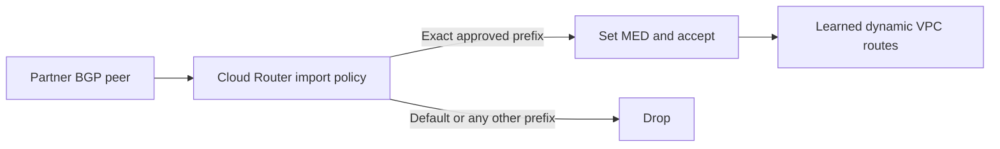

An encrypted VPN tunnel protects packets in transit. It does not decide whether the Border Gateway Protocol (BGP) routes received through that tunnel are appropriate for the Virtual Private Cloud (VPC) network.

A partner can accidentally advertise `0.0.0.0/0`, an unexpectedly broad private range, or a more-specific prefix that diverts production traffic. Cloud Router BGP route policies can filter those advertisements before they become learned dynamic routes. This guide builds a fail-closed import policy for one peer: accept only exact contract-approved prefixes and drop everything else. The commands were reviewed against current Google Cloud documentation on August 31, 2026. Apply the pattern in a test environment and a controlled network change window because attaching a policy can withdraw live routes immediately.

## Define the route contract first

Do not derive the allowlist solely from whatever the peer happens to advertise today. Establish an approved contract with the remote network owner that records:

- each IPv4 and IPv6 prefix the peer may advertise;
- whether only an exact prefix or also more-specific prefixes are allowed;
- the owning application or network segment;
- expected primary and backup peers;
- route preference requirements; and
- an emergency contact and withdrawal procedure.

This example accepts exactly `10.60.0.0/24` and `10.60.1.0/24`. It rejects their more-specific subnets, the IPv4 and IPv6 default routes, and every prefix not present in the approved set.



This control filters BGP route advertisements. It is not a firewall, packet inspection rule, or replacement for application authorization.

## Why default behavior is not enough

Cloud Router route-policy evaluation is fail open: a route that reaches the end of all applied policies without `drop()` is accepted. A policy that drops only `0.0.0.0/0` still accepts an accidental `10.0.0.0/8` or an unapproved `/32`.

A production import policy needs two parts:

1. an explicit allow term for contract-approved prefixes; and
2. a final term that matches and drops every remaining address family.

The catch-all drop makes the policy fail closed. An explicit default-route term is retained as a high-priority, auditable statement even though the final term would also drop it.

## Prerequisites

The procedure assumes an existing Cloud Router BGP session for HA VPN, Cloud VPN, Interconnect, or another supported peer. Prepare:

- the exact project, VPC, region, Cloud Router, interface, and BGP peer names;
- the current ordered import-policy list on that peer;
- the approved prefix contract;
- a second administrative session and network owner during the change;
- a workload that can test every required remote prefix; and
- monitoring for BGP state and route changes.

Use fictional identifiers until they are replaced from the target environment:

```bash
export PROJECT_ID="example-prod-project"
export REGION="us-central1"
export NETWORK="production-vpc"
export ROUTER="partner-vpn-router"
export PEER="partner-bgp-peer"
export VPN_TUNNEL="partner-ha-vpn-tunnel-0"
export PREFIX_SET="partner-approved-prefixes"
export POLICY="partner-import-policy"

gcloud config set project "$PROJECT_ID"
gcloud config get-value project
```

## Capture the current state

Inspect the peer before creating or attaching anything:

```bash
gcloud compute routers describe "$ROUTER" \
  --region="$REGION" \
  --format='yaml(name,network,bgp,bgpPeers,interfaces)'
```

Confirm the selected peer name, interface, peer ASN, address family, advertised routes, and existing `importPolicies`. The attach command later replaces the peer's entire import-policy list. If policies already exist, preserve their intended order or stop and redesign the combined evaluation.

Capture advertisements before policy evaluation:

```bash
gcloud compute routers list-bgp-routes "$ROUTER" \
  --region="$REGION" \
  --peer="$PEER" \
  --address-family=IPV4 \
  --route-direction=INBOUND \
  --no-policy-applied \
  --format=yaml
```

Store the output in the approved change record. Every route required after rollout must appear in the contract and allowlist. Do not proceed merely because a broad route currently provides reachability.

## Implementation

### Create an exact approved-prefix set

Named sets keep contract data separate from policy logic and are generally available in Cloud Router. Create a prefix set on the target router:

```bash
gcloud compute routers add-named-set "$ROUTER" \
  --region="$REGION" \
  --set-name="$PREFIX_SET" \
  --set-type=prefix
```

Add each exact prefix as a literal expression:

```bash
gcloud compute routers add-named-set-element "$ROUTER" \
  --region="$REGION" \
  --set-name="$PREFIX_SET" \
  --new-set-element="'10.60.0.0/24'"

gcloud compute routers add-named-set-element "$ROUTER" \
  --region="$REGION" \
  --set-name="$PREFIX_SET" \
  --new-set-element="'10.60.1.0/24'"
```

A string literal matches the exact prefix. Use `prefix('10.60.0.0/24').orLonger()` only when the route contract explicitly permits every more-specific prefix inside that range. Broadening a prefix set is a production routing change and deserves the same review as adding a firewall allow rule.

Inspect the named set after each update:

```bash
gcloud compute routers list-named-sets "$ROUTER" \
  --region="$REGION"
```

For infrastructure as code, upload a reviewed YAML named-set resource rather than issuing independent mutations from multiple pipelines. Cloud Router fingerprints help prevent conflicting updates.

### Create the import policy

Create an empty import policy:

```bash
gcloud compute routers add-route-policy "$ROUTER" \
  --region="$REGION" \
  --policy-name="$POLICY" \
  --policy-type=IMPORT
```

Add a high-priority term that makes both default-route denials obvious:

```bash
gcloud compute routers add-route-policy-term "$ROUTER" \
  --region="$REGION" \
  --policy-name="$POLICY" \
  --priority=10 \
  --match="destination == '0.0.0.0/0' || destination == '::/0'" \
  --actions="drop()"
```

Accept only prefixes in the named set. This example also overwrites the received multi-exit discriminator (MED) with `2000`:

```bash
gcloud compute routers add-route-policy-term "$ROUTER" \
  --region="$REGION" \
  --policy-name="$POLICY" \
  --priority=100 \
  --match="destination.inAnyRange(prefixSets('$PREFIX_SET'))" \
  --actions="med.set(2000); accept()"
```

Finally, drop every remaining IPv4 or IPv6 route:

```bash
gcloud compute routers add-route-policy-term "$ROUTER" \
  --region="$REGION" \
  --policy-name="$POLICY" \
  --priority=1000 \
  --match="destination.inAnyRange([prefix('0.0.0.0/0').orLonger(), prefix('::/0').orLonger()])" \
  --actions="drop()"
```

The final term is essential because unmatched routes are otherwise accepted. The explicit `accept()` in the approved-prefix term stops further policy evaluation after the MED change.

MED is preference management, not the security boundary. Smaller values are generally preferred when MED participates in best-path selection, but prefix specificity, AS path, origin, neighbor ASN grouping, VPC best-path mode, and inter-region cost can affect the result. Remove `med.set(2000)` if the route contract has no preference requirement.

### Review the complete policy before attachment

```bash
gcloud compute routers get-route-policy "$ROUTER" \
  --region="$REGION" \
  --policy-name="$POLICY" \
  --format=yaml
```

Verify the order and exact expressions:

```text
priority 10:   default IPv4 or IPv6 -> drop
priority 100:  approved exact prefixes -> MED 2000 -> accept
priority 1000: every remaining IPv4 or IPv6 prefix -> drop
```

Do not attach an empty policy or a policy missing the approved-prefix term. An empty policy fails open, while a drop-all policy with no allow term withdraws every learned route.

### Attach the policy to one peer

This command changes live route admission and replaces the peer's current import-policy list:

```bash
gcloud compute routers update-bgp-peer "$ROUTER" \
  --region="$REGION" \
  --peer-name="$PEER" \
  --import-policies="$POLICY"
```

If the peer already uses other import policies, pass the complete reviewed comma-separated list in the required evaluation order. Never copy this single-policy command over an existing list.

Apply the control to one peer first. In an HA VPN pair, changing both BGP sessions simultaneously removes the safer observation window and can withdraw all partner paths if the allowlist is incomplete.

## Verify the result

### Confirm attachment and BGP state

```bash
gcloud compute routers describe "$ROUTER" \
  --region="$REGION" \
  --format="json(bgpPeers)" \
  | jq --arg peer "$PEER" '.bgpPeers[] | select(.name == $peer) | {name, interfaceName, peerAsn, importPolicies}'
```

Confirm only the intended peer references the policy. Monitor the BGP session and tunnel health during the change; a policy can be correct while the transport is down.

### Compare pre-policy and post-policy routes

The pre-policy view shows what the peer sent:

```bash
gcloud compute routers list-bgp-routes "$ROUTER" \
  --region="$REGION" \
  --peer="$PEER" \
  --address-family=IPV4 \
  --route-direction=INBOUND \
  --no-policy-applied \
  --format=yaml
```

The post-policy view shows what survived evaluation:

```bash
gcloud compute routers list-bgp-routes "$ROUTER" \
  --region="$REGION" \
  --peer="$PEER" \
  --address-family=IPV4 \
  --route-direction=INBOUND \
  --policy-applied \
  --format=yaml
```

Post-policy output must contain only approved exact prefixes with the intended MED. `0.0.0.0/0`, unexpected broader routes, and unexpected more-specific routes must be absent. Repeat both commands with `--address-family=IPV6` for a dual-stack BGP session.

### Test application reachability

From controlled workloads, test every approved remote prefix and confirm unrelated production egress still follows its intended route. A route listing is configuration evidence; successful and denied flows are operational evidence.

Do not ask a production partner to advertise a default route merely to prove the drop. Test destructive advertisements in a lab router or use naturally observed pre-policy evidence from a coordinated non-production session.

## Failure modes

### Required partner traffic stops immediately

The allowlist is incomplete, a literal has the wrong prefix length, or the peer depends on a route that was never in the contract. Compare the raw pre-policy list with the named set. Add a prefix only after the network owner confirms its scope; do not remove the final drop term as a shortcut.

### An unapproved route still appears post-policy

Check policy attachment, policy ordering, term priorities, and whether a previous applied policy called `accept()`. Because policies are evaluated in list order, an earlier acceptance can prevent a later drop policy from seeing the route.

### MED does not choose the expected path

Inspect the VPC's legacy or standard best-path selection mode, AS path, origin, peer ASN, competing prefix length, and inter-region costs. Never rely on a high MED to neutralize an unapproved route; drop the route instead.

## Rollback or recovery

The safest recovery for a missing legitimate route is to add the approved exact prefix to the named set, verify the policy, and confirm the post-policy route. Detaching the policy restores fail-open route admission and removes all of its protection.

If an approved emergency rollback requires detachment and the peer had no previous import policy:

```bash
gcloud compute routers update-bgp-peer "$ROUTER" \
  --region="$REGION" \
  --peer-name="$PEER" \
  --import-policies=""
```

If there was a previous policy list, restore that exact ordered list instead of an empty value. Keep the policy and named set for incident analysis until the route event and rollback are understood.

## Production considerations

Manage prefix contracts in version control, require network-owner review, and alert when pre-policy advertisements differ from the approved set even if the policy drops them. That alert exposes partner drift before someone is tempted to broaden the allowlist during an outage.

Apply and verify peers sequentially. Record policy fingerprints, named-set changes, pre-policy routes, post-policy routes, effective reachability, BGP state, and rollback ownership in the change evidence. BGP route policies apply to routes learned directly from the peer, not custom learned routes.

## Key takeaways

- VPN encryption does not validate BGP route advertisements.
- Cloud Router policies fail open unless a final term explicitly drops unmatched routes.
- Exact approved-prefix sets are safer than accepting every route except `0.0.0.0/0`.
- MED influences preference in specific comparisons; it does not make an unapproved route safe.
- Pre-policy, post-policy, and application-flow evidence are all required for operational assurance.

## References

- [BGP route policies overview](https://cloud.google.com/network-connectivity/docs/router/concepts/bgp-route-policies-overview)
- [Create BGP route policies](https://cloud.google.com/network-connectivity/docs/router/how-to/bgp-route-policies/create-policies)
- [Create named prefix sets](https://cloud.google.com/network-connectivity/docs/router/how-to/bgp-route-policies/create-named-sets)
- [BGP route policy attribute reference](https://cloud.google.com/network-connectivity/docs/router/reference/bgp-route-policy-reference)
- [List pre-policy and post-policy BGP routes](https://cloud.google.com/network-connectivity/docs/router/how-to/list-routes)
- [Cloud Router learned routes and best-path selection](https://cloud.google.com/network-connectivity/docs/router/concepts/learned-routes)
