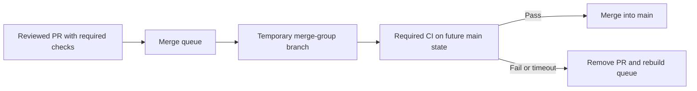

A pull request can pass every required check and still break `main`. The result is not contradictory: CI tested the pull request against one version of the base branch, but another change landed before it. The merge created a combination that no workflow had evaluated.

A GitHub merge queue closes that gap by testing the prospective branch state before merging it. This guide explains when that control is worth its cost, how to make GitHub Actions report the required checks, and how to roll it out without turning the queue into a delivery bottleneck. The behavior and settings were reviewed against GitHub's documentation on August 31, 2026.

## When a merge queue earns its place

Use a queue to solve measured contention, not because it sounds safer. It is most useful when several pull requests land on the same protected branch each day and one or more of these signals are present:

- green pull requests occasionally fail after merge;
- developers repeatedly update branches just to satisfy an up-to-date rule;
- shared packages or generated files create frequent integration conflicts;
- a broken default branch blocks releases or many other contributors; or
- deployments run from every merge and require predictable sequencing.

A low-traffic repository with fast CI may get the same result from required checks and an up-to-date branch rule. A queue adds another CI run and increases feedback time, so record the current merge rate, post-merge failure rate, CI duration, and time from approval to merge before enabling it.

GitHub currently offers merge queues for public repositories owned by organizations and for private organization repositories on GitHub Enterprise Cloud. Personal repositories are not eligible.

## How the queue changes validation

Assume `main` is at `M0`, with pull requests A and B waiting to merge. Both passed independently against `M0`. If A lands first, B's old result says nothing about `M0 + A + B`.

The queue creates a temporary merge group for the future state and requests checks on its SHA:

```text
PR A check: M0 + A
PR B check: M0 + A + B
```

If A fails, GitHub removes A and reconstructs B's merge group without it. Successful required checks allow GitHub to merge according to the configured merge method and queue limits.



The queue reduces one class of integration failure. It does not prove that a change is correct, eliminate flaky tests, or prevent an authorized bypass. Those controls still require useful tests, review, branch protection, and restricted bypass permissions.

## Prerequisites

Before changing the branch rule, confirm that:

- the repository belongs to an eligible GitHub organization;
- `main` already requires pull requests and meaningful status checks;
- each required check can run against a merge-group SHA;
- CI jobs are idempotent and do not deploy from pull-request or merge-group events;
- repository administrators understand the emergency bypass path; and
- workflow names and job names are stable, because required checks identify them by name.

Do not enable the queue until its required workflows recognize the `merge_group` event. Otherwise GitHub waits for checks that never start and eventually removes the pull request.

## Configure GitHub Actions

### Add the merge-group trigger

The minimum trigger listens to both pull requests and the queue's `checks_requested` activity:

```yaml
name: required-ci

on:
  pull_request:
    branches: [main]
  merge_group:
    types: [checks_requested]

permissions:
  contents: read

jobs:
  test:
    name: test
    runs-on: ubuntu-latest
    steps:
      - name: Check out the validated SHA
        uses: actions/checkout@v4

      - name: Set up Node.js
        uses: actions/setup-node@v4
        with:
          node-version: 22
          cache: npm

      - name: Install dependencies
        run: npm ci

      - name: Run required checks
        run: npm test
```

`actions/checkout` uses the event's SHA by default. On `merge_group`, that is the temporary merge-group SHA, which is exactly what the queue needs to validate. Avoid checking out the pull request head explicitly in a shared workflow; doing so silently tests the wrong code.

### Keep deployment out of merge-group runs

Required CI should be safe to repeat. A queue can rebuild speculative groups when an earlier pull request fails or somebody jumps to the front. If the workflow also deploys, sends notifications, or writes external state, guard those jobs by event and branch:

```yaml
  deploy:
    if: github.event_name == 'push' && github.ref == 'refs/heads/main'
    needs: test
    runs-on: ubuntu-latest
    steps:
      - run: ./scripts/deploy.sh
```

Keep the actual deployment in a workflow triggered by a successful push to `main` when possible. The merge-group build is a prediction; it is not the published branch.

### Review concurrency cancellation

A common pull-request workflow cancels older runs on the same branch. That grouping can behave poorly for queue branches if it collapses unrelated merge groups. Use a key that remains unique per event ref:

```yaml
concurrency:
  group: ${{ github.workflow }}-${{ github.ref }}
  cancel-in-progress: true
```

Review the effect before enabling cancellation on expensive tests. GitHub may reconstruct a merge group after queue order changes, and canceling a superseded SHA is useful. Canceling the only required check for a live group is not.

### Configure third-party CI explicitly

Third-party CI does not receive the GitHub Actions event automatically. Configure it to build pushes whose branch starts with:

```text
gh-readonly-queue/main/
```

The provider must report the required status against the temporary branch's head SHA. A successful status attached only to the pull request SHA will not release the merge group.

## Enable the queue

In the repository settings, edit the exact branch protection rule or repository ruleset that targets `main`, then enable **Require merge queue**. A branch protection pattern containing a wildcard cannot be used to enable a merge queue, so target the branch explicitly.

Choose queue settings from observed CI behavior:

- **Merge method:** use the method that already defines the repository's history policy.
- **Build concurrency:** start with `1` or `2`; increase only when runner capacity and queue wait justify it.
- **Status check timeout:** set it above the normal high percentile of required CI duration, including runner startup time.
- **Maximum pull requests to merge:** keep the first rollout small if every merge starts a deployment.
- **Minimum pull requests to merge:** leave it at `1` unless batching saves meaningful CI or deployment cost.
- **Only merge non-failing pull requests:** keep this enabled for a strict initial rollout.

Build concurrency controls how many merge-group check requests GitHub dispatches at once. Merge limits control how many already validated pull requests are merged into the base branch together; they do not combine CI builds. Treat those as separate tuning decisions.

Limit bypass permissions and enable the option that prevents bypassing protections where it fits the repository's incident process. A queue cannot protect `main` from actors who can routinely skip it.

## Verify the result

Use two harmless test pull requests that touch the same small test fixture or dependency, then observe the full flow:

1. Confirm both pull-request workflows complete normally.
2. Add the first pull request to the queue and verify a `merge_group` workflow starts.
3. Inspect the workflow run and confirm `github.event_name` is `merge_group` and the checked-out SHA matches the merge group.
4. Add the second pull request and confirm its group includes the first change ahead of it.
5. Intentionally fail a required check in a test pull request and verify GitHub removes it without merging.
6. Confirm the remaining queue is rebuilt and continues.
7. Confirm deployments run only after a push reaches `main`.

Do not test the failure path with a change that could reach production if a rule is misconfigured. A deterministic unit-test failure is enough.

## Failure modes

### The queue waits for a check forever

The required workflow probably lacks the `merge_group` trigger, uses a path filter that excludes the merge-group change, or reports a different job name. Compare the exact required-check name with the checks attached to the merge-group SHA.

### CI tests the pull request instead of the future branch

Look for checkout logic that forces `github.event.pull_request.head.sha`. That payload field is unavailable on `merge_group`, and even a fallback can select the wrong revision. Use the event SHA unless the workflow has a documented reason not to.

### Queue throughput is worse than direct merging

Measure runner wait separately from test runtime. Add runner capacity or raise build concurrency only after identifying which delay dominates. Larger speculative concurrency can waste more work whenever an early pull request fails.

### A green queue still produces a broken main branch

Check for nondeterministic tests, environment differences, required checks that cover too little, post-merge generation, and deployments that use artifacts other than the validated commit. The queue can validate only the checks and SHA you configured.

## Rollback

If the queue blocks delivery during rollout, stop adding new pull requests, let active groups finish or remove them, and disable **Require merge queue** on the branch rule. Keep pull-request reviews and required checks enabled. Restore the previous up-to-date requirement if that was the former integration control.

Do not remove required checks simply to drain the queue. That hides the misconfiguration and weakens the branch after rollback. Capture the missing event, status name, timeout, or runner-capacity issue, fix it in a test branch, and repeat the controlled rollout.

## Production considerations

Track approval-to-merge time, queue wait, CI duration, removal reasons, post-merge failures, and bypass use for at least a few weeks. A successful rollout should reduce broken-default-branch events without creating an unacceptable delivery delay.

Jumping a pull request to the front rebuilds in-progress groups because it changes the commit graph. Reserve that action for genuine priority work. Also align merge limits with deployment capacity: validating quickly is not useful if downstream systems cannot safely absorb the resulting merge rate.

## Key takeaways

- A merge queue tests the future base-branch state, not only the pull request branch.
- Every required GitHub Actions workflow must handle the `merge_group` event.
- Merge-group jobs must be repeatable and must not deploy speculative code.
- Build concurrency and merge limits solve different capacity problems.
- Rollout success should be measured in branch reliability and delivery time, not queue adoption alone.

## References

- [Managing a merge queue](https://docs.github.com/en/repositories/configuring-branches-and-merges-in-your-repository/configuring-pull-request-merges/managing-a-merge-queue)
- [GitHub Actions `merge_group` event](https://docs.github.com/en/actions/reference/workflows-and-actions/events-that-trigger-workflows#merge_group)
- [Troubleshooting required status checks](https://docs.github.com/en/pull-requests/collaborating-with-pull-requests/troubleshooting-required-status-checks)
- [About protected branches](https://docs.github.com/en/repositories/configuring-branches-and-merges-in-your-repository/managing-protected-branches/about-protected-branches)
