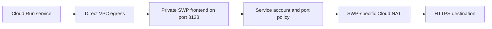

Cloud Run services often need outbound HTTPS for source control, package registries, payment providers, or partner APIs. Giving each revision unrestricted internet access is easy, but it makes source allowlists, incident investigation, and data-exfiltration controls harder to operate.

Google Cloud Secure Web Proxy (SWP) provides a managed checkpoint for HTTP and HTTPS egress. This guide uses explicit proxy mode, Direct VPC egress, a private proxy frontend, a Cloud Run service-account rule, and an optional static public source address. It deliberately excludes TLS inspection. That keeps end-to-end destination TLS intact, but it also limits what the proxy can enforce. The commands and constraints were reviewed against Google Cloud documentation on August 31, 2026; validate them in a non-production project because SWP, networking, NAT, and logging incur ongoing cost.

## Start with the actual policy boundary

The policy in this design answers one narrow question:

> Is the request from the approved Cloud Run service account, and is the requested destination port 443?

Without TLS inspection, an explicit SWP cannot match the hostname of an encrypted HTTPS request. It cannot enforce “GitHub only,” inspect a URL path, or examine HTTP methods, headers, and bodies. A rule that allows destination port `443` permits any explicitly proxied port-443 destination for the approved identity.

This is still useful for central logging and workload segmentation, but do not describe it as a domain allowlist. If domain or content controls are mandatory, evaluate TLS inspection and its private certificate authority, client trust, certificate-pinning, privacy, and exception requirements as a separate security design.

## Request path

The application opens an HTTP connection to the proxy's private address. For an HTTPS destination, its client sends `CONNECT destination.example:443`; after policy allows the session, SWP creates the upstream connection and relays the destination's TLS stream. The SWP-specific Cloud NAT translates the upstream connection to a public address.



The application uses:

```text
HTTP_PROXY=http://10.20.0.10:3128
HTTPS_PROXY=http://10.20.0.10:3128
```

The `http://` scheme in `HTTPS_PROXY` describes the client-to-proxy connection. The final destination remains HTTPS, and its certificate is still validated by the application because this design does not intercept TLS.

## Choose explicit mode deliberately

Explicit mode is a good first deployment when selected applications already support HTTP proxy configuration and a staged rollout matters. It does not transparently capture traffic. A library that ignores `HTTPS_PROXY`, a custom socket, or a deliberate `NO_PROXY` entry can attempt a direct connection.

Treat bypass prevention as a separate acceptance criterion. Route all Cloud Run traffic through the VPC, use a subnet or VPC path without general-purpose internet NAT, and apply reviewed egress firewall controls to the Cloud Run revision's network tag where needed. If an unproxied HTTPS request can still reach the internet, explicit SWP is optional routing, not an enforced egress boundary.

Use next-hop mode when transparent VPC routing better matches the requirement. It also has different hostname-matching behavior: SWP can use Server Name Indication for encrypted next-hop traffic without TLS inspection. Do not transfer that capability to an explicit-mode design.

## Prerequisites

Before provisioning SWP, prepare:

- a VPC and normal `PRIVATE` subnet in the target region;
- an active `REGIONAL_MANAGED_PROXY` subnet, with `/23` as Google's recommended size;
- a Cloud Run service with Direct VPC egress in the same network path;
- a dedicated runtime service account for the proxied workload;
- an approved private frontend address and port;
- an egress design that prevents direct bypass; and
- test destinations under your control for allowed and denied cases.

The normal subnet is referenced by the gateway and contains its frontend address. The proxy-only subnet is not referenced by the gateway; Google uses it for the managed proxy fleet. The public NAT address is a third address with a different purpose.

Set placeholders and verify the active project:

```bash
export PROJECT_ID="example-project"
export REGION="us-central1"
export NETWORK="egress-vpc"
export CLIENT_SUBNET="egress-clients"
export PROXY_SUBNET="egress-proxy-only"
export PROXY_RANGE="10.20.240.0/23"
export PROXY_IP="10.20.0.10"
export PROXY_PORT="3128"

export POLICY="cloud-run-egress-policy"
export RULE="allow-cloud-run-https"
export GATEWAY="cloud-run-egress-proxy"
export SERVICE="outbound-worker"
export SERVICE_ACCOUNT="outbound-worker@example-project.iam.gserviceaccount.com"

gcloud config set project "$PROJECT_ID"
gcloud config get-value project
```

## Implementation

### Inspect and create the proxy-only subnet

Do not create a duplicate or overlapping managed-proxy range:

```bash
gcloud compute networks subnets list \
  --filter="network:$NETWORK AND region:($REGION)" \
  --format="table(name,ipCidrRange,purpose,role)"
```

Create the subnet only when the network and region do not already have an appropriate active range:

```bash
gcloud compute networks subnets create "$PROXY_SUBNET" \
  --network="$NETWORK" \
  --region="$REGION" \
  --range="$PROXY_RANGE" \
  --purpose=REGIONAL_MANAGED_PROXY \
  --role=ACTIVE
```

The active proxy-only subnet may be shared by compatible managed proxies. Its lifecycle belongs to the network platform, not one application.

### Create the gateway security policy

Create `policy.yaml` with a fully qualified policy name:

```yaml
description: Explicit egress policy for selected Cloud Run services
name: projects/example-project/locations/us-central1/gatewaySecurityPolicies/cloud-run-egress-policy
```

Import it:

```bash
gcloud network-security gateway-security-policies import "$POLICY" \
  --source=policy.yaml \
  --location="$REGION"
```

SWP has a default deny posture. Add only the access the application requires.

### Add one identity-scoped HTTPS rule

Create `rule.yaml`:

```yaml
name: projects/example-project/locations/us-central1/gatewaySecurityPolicies/cloud-run-egress-policy/rules/allow-cloud-run-https
description: Allow the outbound worker to create port 443 proxy sessions
enabled: true
priority: 100
basicProfile: ALLOW
sessionMatcher: "source.matchServiceAccount('outbound-worker@example-project.iam.gserviceaccount.com') && destination.port == 443"
```

Import the rule:

```bash
gcloud network-security gateway-security-policies rules import "$RULE" \
  --source=rule.yaml \
  --location="$REGION" \
  --gateway-security-policy="$POLICY"
```

Lower numeric priorities are evaluated first. Keep priorities unique and review rules as an ordered policy, not as independent allow statements. Create or update rules sequentially when the API reports policy contention; concurrent writers can return conflict errors.

Direct VPC egress supports service-account source matching for Cloud Run. If the workload uses a Serverless VPC Access connector instead, Google documents the connector's unique source range as the available identity boundary. Do not assume service-account matching survives every network architecture.

### Deploy the explicit proxy gateway

Create `gateway.yaml`:

```yaml
name: projects/example-project/locations/us-central1/gateways/cloud-run-egress-proxy
type: SECURE_WEB_GATEWAY
addresses: ["10.20.0.10"]
ports: [3128]
gatewaySecurityPolicy: projects/example-project/locations/us-central1/gatewaySecurityPolicies/cloud-run-egress-policy
network: projects/example-project/global/networks/egress-vpc
subnetwork: projects/example-project/regions/us-central1/subnetworks/egress-clients
routingMode: EXPLICIT_ROUTING_MODE
```

Import the gateway:

```bash
gcloud network-services gateways import "$GATEWAY" \
  --source=gateway.yaml \
  --location="$REGION"
```

An HTTP proxy frontend does not require a proxy-serving TLS certificate. The application's HTTPS session remains encrypted through the tunnel. If clients must connect to the proxy itself over HTTPS, certificate configuration is a separate frontend requirement.

Frontend ports cannot be changed after gateway creation, and SWP supports a maximum of five. Decide the port set and whether global access is required before provisioning; global access can be enabled only when the gateway is created.

### Configure Cloud Run to use the proxy

Send all egress through the VPC so direct internet traffic can be governed alongside the proxy path:

```bash
gcloud run services update "$SERVICE" \
  --region="$REGION" \
  --service-account="$SERVICE_ACCOUNT" \
  --network="$NETWORK" \
  --subnet="$CLIENT_SUBNET" \
  --vpc-egress=all-traffic \
  --network-tags=swp-client \
  --update-env-vars="HTTP_PROXY=http://${PROXY_IP}:${PROXY_PORT},HTTPS_PROXY=http://${PROXY_IP}:${PROXY_PORT}"
```

Add `NO_PROXY` only for exact destinations that must remain direct, such as required internal services or metadata access. Proxy environment-variable behavior differs across runtimes and libraries, so test every outbound client used by the service. Some gRPC, Git, package-manager, and custom HTTP stacks require an explicit proxy agent.

Do not assume `all-traffic` alone prevents bypass. Inspect Cloud NAT, default internet routes, firewall rules, Private Google Access, and every other egress path available to the client subnet. Preserve required access to Google APIs deliberately rather than adding a broad internet exception.

### Assign a static public egress address when required

The first SWP gateway in a VPC network and region creates an SWP-specific Cloud Router and Cloud NAT automatically. The NAT initially uses automatic address allocation. Keep that behavior unless a partner allowlist requires static addresses.

Reserve a regional external address:

```bash
export NAT_IP="swp-egress-ip-1"

gcloud compute addresses create "$NAT_IP" \
  --region="$REGION"
```

Discover the generated router rather than guessing its suffix:

```bash
gcloud compute routers list \
  --region="$REGION" \
  --filter="network:($NETWORK) AND name:(swg-autogen-router-*)" \
  --format='value(name)'
```

After confirming there is exactly one intended result, inspect and update its `swg-autogen-nat` configuration:

```bash
export SWP_ROUTER="swg-autogen-router-1"

gcloud compute routers nats list \
  --router="$SWP_ROUTER" \
  --region="$REGION"

gcloud compute routers nats update swg-autogen-nat \
  --router="$SWP_ROUTER" \
  --region="$REGION" \
  --nat-external-ip-pool="$NAT_IP"
```

This update changes live outbound identity. Coordinate external allowlists before switching and retain enough NAT addresses and ports for peak concurrency. Only SWP endpoints in that VPC and region can use this generated NAT; it is not a general-purpose NAT for other workloads.

## Verify the control

Test from a canary revision with the intended service account, network, and proxy settings.

### Prove an allowed request

Send an authenticated request to a controlled HTTPS endpoint and confirm:

- the application validates the destination certificate;
- the request succeeds through `HTTP_PROXY` or `HTTPS_PROXY`;
- the destination observes one of the approved SWP NAT addresses; and
- the SWP transaction log records the expected source, rule, and allow decision.

SWP transaction logs use the `networkservices.googleapis.com/gateway_requests` log name in Cloud Logging.

### Prove policy denial

Repeat the request from a canary that has a different service account. Reachability followed by HTTP `403` is evidence that the gateway received and denied the proxy request. Also use a controlled destination on a disallowed port to prove the port rule, rather than relying on a random closed port that cannot distinguish policy denial from network failure.

### Prove direct bypass fails

Force the same client to avoid proxy environment variables:

```bash
curl --noproxy '*' --connect-timeout 5 https://controlled-test.example
```

The direct request must fail while the explicitly proxied request succeeds. If both succeed, fix the VPC, NAT, route, firewall, or application configuration before describing SWP as mandatory.

### Inspect the live gateway and policy

```bash
gcloud network-services gateways describe "$GATEWAY" \
  --location="$REGION"

gcloud network-security gateway-security-policies rules list \
  --gateway-security-policy="$POLICY" \
  --location="$REGION"
```

Confirm the private address, port, routing mode, associated policy, service-account matcher, priority, and enabled state match the reviewed configuration.

## Failure modes

### The service ignores `HTTPS_PROXY`

Test the exact library and protocol, not only `curl`. Configure the runtime's supported proxy agent where needed. Do not add direct egress as a silent fallback because one client lacks proxy support.

### The rule allows more destinations than expected

A source identity plus destination port is not a hostname restriction. In explicit mode, encrypted HTTPS host matching requires TLS inspection under current SWP behavior. Update the threat model or redesign the inspection approach instead of claiming the port rule is narrower.

### The destination sees changing source addresses

The generated NAT still uses automatic allocation, or multiple manual addresses are assigned. Verify the live NAT configuration and ensure the partner allowlists every address that can be selected.

### Requests fail after adding `NO_PROXY`

`NO_PROXY` syntax is runtime-specific, especially for suffixes, ports, and CIDRs. Keep the list narrow and test each bypassed destination. A broad suffix can create an unintended direct internet path.

## Rollback and cleanup

Roll out the proxy on a canary revision and retain the prior revision's complete network and environment configuration. If SWP fails, route traffic back to that revision; do not partially remove proxy variables while leaving a new all-traffic egress policy in place.

For a disposable environment, remove application proxy configuration, delete the gateway, then remove its generated NAT and router as Google documents. Delete the rule, policy, static address, and application-owned subnet resources only after checking for shared users. A reserved static address continues to incur cost while unused.

## Production considerations

Explicit SWP is regional unless global access was enabled at creation. Design multiple regions and failover rather than pointing every workload at one regional gateway. Monitor gateway availability, policy denials, transaction latency, processed bytes, NAT port use, static address health, and direct-egress attempts.

Review current pricing and quotas before centralizing many workloads. Gateway hours, processed data, networking, NAT, and logging all contribute cost. Also remember that SWP blocks UDP rules and does not proxy HTTP/3, so inventory protocols before migration.

## Key takeaways

- Explicit SWP controls only traffic that clients actually send to the proxy.
- Without TLS inspection, explicit-mode HTTPS rules cannot enforce destination hostnames.
- Direct VPC egress can support Cloud Run service-account source matching.
- A direct `--noproxy` test is required to prove that bypass is blocked.
- Static source IPs come from the SWP-specific generated Cloud NAT, not the private frontend.

## References

- [Secure Web Proxy overview](https://cloud.google.com/secure-web-proxy/docs/overview)
- [Initial setup steps](https://cloud.google.com/secure-web-proxy/docs/initial-setup-steps)
- [Create and deploy an explicit Secure Web Proxy](https://cloud.google.com/secure-web-proxy/docs/quickstart)
- [Secure Web Proxy security rules](https://cloud.google.com/secure-web-proxy/docs/configure-rules)
- [Secure Web Proxy source identities](https://cloud.google.com/secure-web-proxy/docs/create-a-policy)
- [Use Cloud NAT for Secure Web Proxy](https://cloud.google.com/secure-web-proxy/docs/use-cloud-nat-for-swp)
- [Configure Direct VPC egress for Cloud Run](https://cloud.google.com/run/docs/configuring/vpc-direct-vpc)
- [View proxy transaction logs](https://cloud.google.com/secure-web-proxy/docs/view-proxy-transaction-logs)
