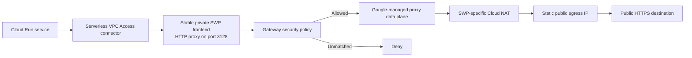

# How Google Cloud Secure Web Proxy Works in an Explicit-Proxy Architecture

Outbound internet access is easy to add and surprisingly difficult to govern.
An application might need to call a source-control provider, download a package,
reach a payment API, or talk to an AI service. Giving every workload unrestricted
egress solves the immediate connectivity problem, but it also creates an
unmonitored path for data exfiltration, compromised dependencies, and accidental
calls to the wrong endpoint.

Google Cloud Secure Web Proxy (SWP) provides a managed checkpoint for HTTP and
HTTPS egress. This article explains how an explicit-routing SWP deployment works,
including a practical serverless design in which several Cloud Run services use
Serverless VPC Access connectors, a private proxy frontend, source-CIDR policy
rules, and a static public egress address.

The design deliberately does not use TLS inspection. That keeps certificate
management and application trust changes out of the first rollout, but it also
places an important limit on what the policy can enforce.

> This article was checked against the Google Cloud documentation on
> July 27, 2026. Product behavior, quotas, preview features, and prices can
> change, so follow the linked documentation when implementing the design.

## The short version

The traffic path looks like this:



The application is configured with a proxy URL such as:

```text
HTTP_PROXY=http://<private-proxy-ip>:3128
HTTPS_PROXY=http://<private-proxy-ip>:3128
```

The `http://` scheme in `HTTPS_PROXY` is intentional. It describes how the client
connects to the proxy, not the scheme of the final destination. For an HTTPS
request, the client opens a TCP connection to the proxy and sends an HTTP
`CONNECT` request for the destination's port 443. If policy allows the session,
the proxy opens a separate upstream connection and relays the TLS stream.

Because TLS inspection is disabled, TLS remains end-to-end between the
application and the destination. The proxy can enforce the source and destination
port controls used in this design, but it cannot inspect the encrypted HTTP path,
method, headers, or body.

## What SWP actually is

SWP is a regional, Google-managed egress proxy. The control plane consists of a
gateway, a gateway security policy, and rules. The data plane is operated and
scaled by Google. According to the
[SWP overview](https://docs.cloud.google.com/secure-web-proxy/docs/overview),
Google manages the proxy servers, patching, and capacity scaling.

The gateway is the private endpoint clients connect to. The policy is a
reusable container. Its rules decide which sessions are allowed or denied.
Google documents three deployment modes:

- **Explicit proxy routing:** clients are configured to connect directly to the
  proxy.
- **Next-hop routing:** VPC routes send matching traffic to SWP without
  configuring each client as an explicit proxy.
- **Private Service Connect publication:** SWP is exposed as a service for
  centralized, multi-VPC designs.

The implementation discussed here uses explicit routing. This mode is a good fit
when only selected applications should use the proxy and those applications
already support standard proxy configuration.

## The Google Cloud building blocks

Although SWP looks like one product in the console, the implementation crosses
several Google Cloud APIs:

- the Network Services API owns the gateway;
- the Network Security API owns the gateway policy and rules;
- the Compute Engine API owns the VPC, subnets, internal and external addresses,
  Cloud Router, and Cloud NAT;
- Certificate Manager is part of Google's documented initial API setup, although
  this design creates no certificate resources because clients connect to the
  proxy over HTTP and TLS inspection is disabled;
- Certificate Authority Service becomes relevant if TLS inspection is added.

Manage API activation in the project-level infrastructure stack before planning
the regional resources. Do not enable an API imperatively during a Terraform
deployment; otherwise, the project configuration and actual API state can drift.
Google maintains the current prerequisite list in the
[initial setup guide](https://docs.cloud.google.com/secure-web-proxy/docs/initial-setup-steps).

## Four different address spaces are involved

Most SWP confusion comes from treating every subnet or IP as if it had the same
job. It does not. There are four distinct address roles.

### 1. The workload or connector source range

Cloud Run reaches the proxy's private address through a Serverless VPC Access
connector. Requests entering the VPC have a source address from the connector's
CIDR. Google explicitly documents that a connector's requests use source
addresses from its configured range in
[Send serverless traffic to a VPC network](https://docs.cloud.google.com/vpc/docs/serverless-vpc-access).

That makes connector CIDRs useful policy boundaries. A representative design
might have:

- one connector shared by a group of primary services;
- a second connector for an isolated sandbox service;
- a third connector for a code-generation workload.

Each connector gets a separate allow rule. This is more auditable than one rule
covering the entire application subnet, and it avoids granting access to
unrelated workloads.

The tradeoff is identity granularity. Services sharing a connector are
indistinguishable to an IP-based rule. Google notes in its
[security-policy documentation](https://docs.cloud.google.com/secure-web-proxy/docs/create-a-policy)
that Serverless VPC Access does not provide service-account or secure-tag source
matching for this purpose; the connector's unique source range can be used
instead.

### 2. The ordinary private client subnet

The SWP gateway frontend receives a stable internal IPv4 address from a normal
`PRIVATE` VPC subnet. This is the address used in `HTTP_PROXY` and
`HTTPS_PROXY`.

Reserve the address independently from the gateway. Doing so gives applications
a stable endpoint even if the gateway must be recreated. Allow the platform to
select an unused address unless the organization has an approved private-IP
allocation registry.

There is an important deployment detail: when a pre-reserved frontend address is
used, the Compute address resource name must match the gateway's short name.
The Gateway API rejects a reserved address with a different name even when the
numeric IP and subnet are otherwise correct. Use one canonical name for both
resources from the beginning.

### 3. The regional proxy-only subnet

SWP also requires a regional proxy-only subnet with:

```text
purpose = REGIONAL_MANAGED_PROXY
role    = ACTIVE
```

This is not the subnet referenced in the gateway's `subnetwork` field. Google
uses the proxy-only range internally for the managed Envoy proxy fleet and its
interaction with Cloud NAT and VPC destinations. The
[initial setup guide](https://docs.cloud.google.com/secure-web-proxy/docs/initial-setup-steps)
explicitly says that proxy-only subnets are required but are not referenced when
creating the SWP instance.

Google recommends a `/23` proxy-only subnet to leave enough space for scaling.
If an existing production network has a smaller active range, reusing it avoids
a destructive subnet replacement, but capacity should be reviewed and monitored.
For a given purpose, region, and VPC, Google permits one `ACTIVE` and one
`BACKUP` proxy-only subnet. A backup does not serve traffic at the same time as
the active subnet. See
[Proxy-only subnets for Envoy-based load balancers](https://docs.cloud.google.com/load-balancing/docs/proxy-only-subnets).

### 4. The public NAT address

The private frontend address is not the address seen by internet destinations.
When the first SWP gateway is provisioned in a VPC and region, Google
automatically creates an SWP-specific Cloud Router and Cloud NAT. That NAT
translates proxy traffic to public addresses.

By default, the NAT uses automatic public-IP allocation. This is convenient but
unsuitable when a third party requires a fixed source IP allowlist. The
[Cloud NAT for SWP guide](https://docs.cloud.google.com/secure-web-proxy/docs/use-cloud-nat-for-swp)
explains that the generated NAT can be changed to use reserved static external
addresses.

In an infrastructure-as-code workflow, this typically becomes a two-stage
lifecycle:

1. Create the first SWP gateway and let Google create the SWP router and NAT.
2. Discover the generated router, adopt the existing NAT into Terraform state,
   and configure it for manual allocation with a separately managed static
   external address.

Do not create a second NAT that conflicts with the generated one, and do not
attach an address that is simultaneously assigned to another Cloud NAT. A static
IP should be moved only through a reviewed plan that proves the existing NAT
loses no address it still needs.

The SWP NAT is scoped to SWP endpoints in its region and VPC. Other VMs or GKE
nodes cannot use it as a general-purpose egress NAT, as described in Google's
[SWP quickstart](https://docs.cloud.google.com/secure-web-proxy/docs/quickstart).

## What happens to an HTTPS request

Consider a service calling `https://api.example.com/v1/data`.

1. The application's HTTP client reads `HTTPS_PROXY`.
2. It opens a TCP connection to the proxy's private IP on port 3128.
3. Because that target is internal, the connection travels through the
   Serverless VPC Access connector into the VPC.
4. The proxy receives a request to establish a tunnel to the destination's port 443.
5. SWP evaluates gateway security rules in priority order. Lower numeric values
   have higher priority, and evaluation stops at the first matching rule.
6. A representative rule evaluates:

   ```text
   inIpRange(source.ip, '<approved-connector-cidr>') &&
   destination.port == 443
   ```

7. If the source range and port match, SWP permits the session. If no rule
   matches, the default deny posture blocks it.
8. SWP opens the upstream connection and relays the client's TLS traffic.
9. The SWP-specific Cloud NAT translates the connection to the configured public
   egress IP.
10. The destination sees the NAT address as the source.

Google describes policy priority and first-match evaluation in
[Policies and rules](https://docs.cloud.google.com/secure-web-proxy/docs/policies-and-rules-overview).
It also documents `source.ip`, `destination.port`, and `inIpRange` as valid
session-matcher inputs in
[Security rules](https://docs.cloud.google.com/secure-web-proxy/docs/configure-rules).

## What the policy allows—and what it does not

The policy in this design has one allow rule per approved connector range. Each
rule permits port 443. There is no catch-all allow rule, and unmatched traffic
remains denied.

This achieves two useful controls:

- only workloads whose traffic originates from an approved connector range can
  use the proxy;
- those workloads can ask the proxy to establish only HTTPS-port sessions.

It does **not** mean “GitHub only,” “package registries only,” or even “HTTPS
websites only” in a content-aware sense. It means “a TCP connection through the
explicit proxy to destination port 443.”

This distinction matters because the deployment has no TLS inspection. Google's
current
[host-matching documentation](https://docs.cloud.google.com/secure-web-proxy/docs/configure-rules)
states that explicit-proxy mode cannot perform host matching for encrypted HTTPS
without TLS inspection. The `destination.ip` attribute is also unavailable for
that purpose. Therefore, a port-only rule allows explicitly proxied port-443
destinations broadly.

If domain, URL path, HTTP method, or header enforcement is required, redesign
the policy around the supported matchers and evaluate TLS inspection. TLS
inspection requires a trusted certificate-authority design, client trust
distribution, additional IAM and APIs, and careful handling of certificate
pinning and sensitive traffic. It should be a deliberate security program, not
a checkbox added during an egress rollout.

## Why explicit routing was a reasonable first step

Explicit routing has several practical advantages for a targeted serverless
rollout.

### It limits blast radius

Only selected services receive proxy configuration. Existing workloads and
unrelated egress paths remain untouched while the proxy is validated.

### It works with standard application settings

Many runtimes and HTTP libraries understand `HTTP_PROXY`, `HTTPS_PROXY`, and
`NO_PROXY`. The proxy endpoint can be rolled out as configuration instead of a
network-wide route change.

That convenience is not universal. Some SDKs, language runtimes, gRPC clients,
Git implementations, and custom connection pools ignore proxy environment
variables or require an explicit proxy agent. Each outbound transport must be
tested.

### It preserves end-to-end TLS

Without TLS inspection, applications continue to validate the real
destination's certificate. There is no private CA to distribute and no
man-in-the-middle certificate lifecycle to operate.

### It centralizes egress observability

SWP writes proxy transaction logs to Cloud Logging under:

```text
networkservices.googleapis.com/gateway_requests
```

Google states that these logs record every transaction mediated by the proxy.
See
[View proxy transaction logs](https://docs.cloud.google.com/secure-web-proxy/docs/view-proxy-transaction-logs)
and [Logs and metrics](https://docs.cloud.google.com/secure-web-proxy/docs/monitor-logs).

### It creates a stable public identity

Once the SWP NAT uses a reserved public address, external vendors can allowlist
one reviewed egress identity instead of a changing pool of ephemeral addresses.

### It removes proxy-server operations

There are no self-managed proxy VMs to patch, autoscale, or replace. Google
operates the managed data plane while the platform team owns policy,
connectivity, and lifecycle configuration.

## Infrastructure-as-code structure

A clean Terraform design separates environment-independent behavior from
environment-specific values.

The reusable module should own:

- `google_network_security_gateway_security_policy`;
- `google_network_security_gateway_security_policy_rule`;
- `google_network_services_gateway`;
- optionally, the adopted `google_compute_router_nat`;
- validation of ports, rule priorities, CIDRs, and resource references;
- outputs for the gateway ID, private addresses, policy, rule IDs, port, proxy
  URL, and NAT address.

The environment configuration should own:

- whether SWP is enabled;
- region, network, and private-subnet selection;
- gateway and policy names;
- the frontend address resource key;
- connector CIDRs and priorities;
- labels;
- whether the generated NAT has been adopted;
- the reserved public egress address;
- deletion behavior.

The deployment order should be:

```text
Required APIs
  -> VPC and active regional proxy-only subnet
  -> stable private frontend address
  -> gateway security policy
  -> policy rules, created sequentially
  -> explicit-routing SWP gateway
  -> generated router/NAT discovery and Terraform adoption
  -> static public NAT address assignment
  -> application proxy configuration
```

Rule creation deserves special attention. Google documents that creating rules
for the same policy in parallel is unsupported and can return `409 Conflict` or
`Resource busy`; rules must be created sequentially. See
[Troubleshoot policy and rule errors](https://docs.cloud.google.com/secure-web-proxy/docs/troubleshoot-policy-rule-errors).
A Terraform `for_each` alone does not serialize sibling resources. The apply
path must enforce single-writer behavior, for example by running the narrowly
scoped SWP unit with Terraform parallelism set to one.

For lifecycle protection, the gateway and policy can use the provider's
`PREVENT` deletion policy. The gateway option that deletes the auto-generated
router should remain false unless removal of that shared regional infrastructure
is explicitly intended. The official
[Terraform gateway resource documentation](https://registry.terraform.io/providers/hashicorp/google/latest/docs/resources/network_services_gateway)
describes both controls.

## Application rollout details

For an HTTP proxy frontend on port 3128, a typical service configuration is:

```text
HTTP_PROXY=http://<private-proxy-ip>:3128
HTTPS_PROXY=http://<private-proxy-ip>:3128
```

Add a carefully reviewed `NO_PROXY` value for destinations that must remain
direct, such as the metadata server and internal service endpoints. Do not copy
a generic list blindly: bypass rules are part of the security boundary.

Before production rollout:

1. Confirm the service sends requests to the VPC connector.
2. Confirm its HTTP clients honor proxy configuration.
3. Test an allowed HTTPS request.
4. Test a blocked source range or blocked destination port.
5. Confirm the destination observes the static SWP NAT address.
6. Confirm proxy transaction logs contain the expected allow and deny events.
7. Check latency, connection reuse, NAT port consumption, and application
   timeout behavior under load.

A simple connectivity test from an approved source is:

```bash
curl --verbose \
  --proxy http://<private-proxy-ip>:3128 \
  https://example.com/
```

Run a corresponding negative test from an unapproved source. A successful
network connection followed by `403 Forbidden` can be useful evidence that the
gateway is reachable and its deny policy is working; Google's quickstart uses
this behavior as a policy test.

## Benefits

This architecture is particularly valuable when an organization needs:

- controlled outbound access from serverless workloads;
- a deny-by-default egress checkpoint;
- a stable source IP for partner or customer allowlists;
- centralized transaction logging for incident response;
- separate policy boundaries for production, sandbox, or code-execution
  workloads;
- managed proxy capacity without operating a VM or appliance fleet;
- a staged rollout that does not immediately reroute an entire VPC;
- Terraform-reviewed policy and lifecycle changes.

Common use cases include calling third-party APIs, reaching source-control
providers, downloading build dependencies, controlling webhook delivery, and
auditing internet access from isolated workloads.

## Limitations and operational risks

SWP is not a complete egress-security strategy by itself.

### Explicit clients can bypass it

Explicit mode governs traffic that is actually sent to the proxy. If a workload
still has direct internet egress and its client ignores the proxy setting, the
request can bypass SWP. Preventing bypass requires complementary controls:
application testing, appropriate Cloud Run egress configuration, firewall or
routing policy where applicable, and monitoring for direct outbound traffic.

### No TLS inspection means limited destination control

The design cannot inspect encrypted paths, methods, headers, or payloads. In
explicit mode, it also cannot enforce HTTPS hostname matching without TLS
inspection under the current documented behavior. Source-CIDR plus port 443 is
useful segmentation, not a domain allowlist.

### Connector CIDRs are coarse identities

All services sharing a connector share a policy identity. If one service needs a
different rule, give it a distinct connector range or move to a supported
identity-aware architecture.

### The service is regional by default

Clients normally need to be in the same region as the gateway. Global access is
currently documented as Preview and must be enabled when the gateway is created;
it cannot be added later. See
[Configure global access](https://docs.cloud.google.com/secure-web-proxy/docs/configure-global-access).
Multi-region resilience therefore needs explicit design and testing.

### The first gateway creates side-effect resources

The first gateway creates the SWP router and NAT. Static-IP configuration cannot
be fully expressed before those resources exist, so the initial deployment and
Terraform adoption are separate lifecycle stages. Deletion also requires
careful coordination.

### Proxy-only address capacity matters

Google recommends a `/23`. A smaller existing range can become a scaling
constraint. Because only one active subnet exists for a given regional purpose,
changing ranges is an operational migration rather than a casual edit.

### Protocol support is intentionally limited

The [SWP overview](https://docs.cloud.google.com/secure-web-proxy/docs/overview)
currently lists IPv4 only, HTTP versions through HTTP/2, and no HTTP/3. Google
also documents that UDP proxy rules are unsupported, so UDP traffic is blocked.

### NAT port capacity must be monitored

A single public IP provides a finite number of source ports. High connection
churn, weak keep-alive behavior, or many simultaneous upstream destinations can
cause port pressure. Dynamic port allocation and sensible minimum/maximum port
settings help, but load testing and NAT metrics are still necessary.

### Cost is continuous

SWP charges for gateway hours and processed data, with related networking and
logging costs potentially applying. At the time this article was checked,
Google listed a standard gateway-hour charge and a per-GB processing charge.
Use the current [SWP pricing page](https://cloud.google.com/secure-web-proxy/pricing)
rather than hardcoding those prices into a design document.

### Quotas apply

Google currently documents per-project, per-region quotas for gateways, policies,
and URL lists, plus limits such as 500 rules per policy. Review
[SWP quotas and limits](https://docs.cloud.google.com/secure-web-proxy/docs/quotas)
before designing a large multi-tenant policy surface.

## When this design is a good fit

Use this pattern when:

- workloads already support explicit HTTP proxies;
- a private regional endpoint is acceptable;
- source-network segmentation is sufficient for the first policy iteration;
- end-to-end TLS must remain untouched;
- outbound HTTPS needs centralized logs and a stable public source IP;
- infrastructure changes must be reviewable and reproducible in Terraform.

Consider another or expanded design when:

- all VPC egress must be transparently intercepted;
- policies require domain or URL-path controls for encrypted traffic;
- workloads use UDP, HTTP/3, or clients that cannot speak through an HTTP proxy;
- per-service identity is required but several services share one connector;
- active-active multi-region egress is mandatory;
- the organization cannot accommodate the generated router/NAT lifecycle.

## Final perspective

The useful mental model is not “a NAT with filtering.” SWP is a managed
application-aware checkpoint with two sides:

- a private frontend where explicitly configured clients connect; and
- a managed egress path where the proxy creates upstream connections and exits
  through its dedicated Cloud NAT.

The policy sits between those sides. In the design described here, it answers a
narrow question: “Is this session coming from an approved connector range, and
is it targeting port 443?” That is a meaningful improvement over unrestricted
egress, but it must not be mistaken for destination-domain enforcement.

The strongest production implementation is honest about that boundary, reserves
both private and public addresses deliberately, serializes policy writes, protects
generated routing infrastructure from accidental deletion, and treats
application rollout and negative testing as part of the security control—not as
an afterthought.

## Official references

- [Secure Web Proxy overview](https://docs.cloud.google.com/secure-web-proxy/docs/overview)
- [Initial setup steps](https://docs.cloud.google.com/secure-web-proxy/docs/initial-setup-steps)
- [Secure Web Proxy quickstart](https://docs.cloud.google.com/secure-web-proxy/docs/quickstart)
- [Security policies](https://docs.cloud.google.com/secure-web-proxy/docs/create-a-policy)
- [Security rules](https://docs.cloud.google.com/secure-web-proxy/docs/configure-rules)
- [Policies and rules overview](https://docs.cloud.google.com/secure-web-proxy/docs/policies-and-rules-overview)
- [Cloud NAT for Secure Web Proxy](https://docs.cloud.google.com/secure-web-proxy/docs/use-cloud-nat-for-swp)
- [Serverless VPC Access](https://docs.cloud.google.com/vpc/docs/serverless-vpc-access)
- [Proxy-only subnets](https://docs.cloud.google.com/load-balancing/docs/proxy-only-subnets)
- [Proxy transaction logs](https://docs.cloud.google.com/secure-web-proxy/docs/view-proxy-transaction-logs)
- [Logs and metrics](https://docs.cloud.google.com/secure-web-proxy/docs/monitor-logs)
- [Policy and rule troubleshooting](https://docs.cloud.google.com/secure-web-proxy/docs/troubleshoot-policy-rule-errors)
- [Global access](https://docs.cloud.google.com/secure-web-proxy/docs/configure-global-access)
- [Quotas and limits](https://docs.cloud.google.com/secure-web-proxy/docs/quotas)
- [Secure Web Proxy pricing](https://cloud.google.com/secure-web-proxy/pricing)
- [Terraform Network Services gateway resource](https://registry.terraform.io/providers/hashicorp/google/latest/docs/resources/network_services_gateway)
